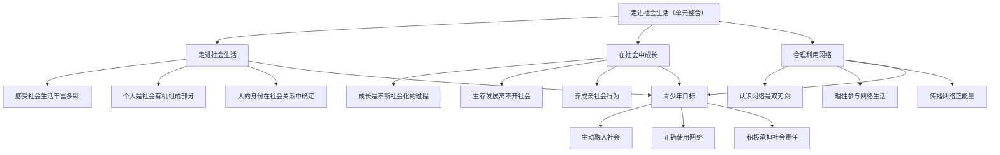

# 单元思考与行动

## 核心概念

本单元以"走进社会生活"为主题，引导我们认识个人与社会的关系，理解社会化的意义，学会合理利用网络，培养亲社会行为，为成长为合格社会成员奠定坚实基础。单元知识相互联系，共同指向"在社会中成长"这一核心目标。

## 知识框架

### 一、走进社会生活

1. 感受社会生活的丰富多彩。
2. 理解个人是社会的有机组成部分。
3. 认识人的身份在社会关系中确定。

### 二、在社会中成长

1. 人的成长是不断社会化的过程。
2. 人的生存和发展离不开社会。
3. 养成亲社会行为，服务社会、奉献社会。

### 三、合理利用网络

1. 认识网络是把双刃剑。
2. 理性参与网络生活。
3. 传播网络正能量。

### 四、单元知识整合

1. 个人、社会、网络三者相互联系。
2. 青少年要主动融入社会、正确使用网络、积极承担社会责任。
3. 在社会实践中成长，在奉献中实现价值。

## 案例分析

**案例**：学校开展"我是社区小主人"实践活动，同学们分组参与社区环境整治、文明宣传、关爱老人等服务，并通过网络平台分享活动心得。

**分析**：该活动将本单元知识融会贯通。同学们在实践中感受社会生活、培养亲社会行为，体现了个人与社会的紧密联系；同时利用网络传播正能量，展示了新时代青少年的责任担当。这一案例说明，理论知识只有与社会实践相结合，才能真正内化为自身素养。

## 背记要点

- 个人与社会相互依存、相互制约。
- 社会化是个人成长的必经之路。
- 亲社会行为在人际交往和社会实践中养成。
- 理性参与网络生活，做负责任的网络参与者。
- 在社会中成长，在奉献中实现人生价值。

## 自测题

1. 本单元的核心主题是什么？
2. 如何理解个人与社会的关系？
3. 网络生活中应注意哪些问题？
4. 青少年可以通过哪些方式培养亲社会行为？
5. 请结合本单元知识，设计一个社会实践活动方案。

相关知识点：[[第一课 丰富的社会生活]]、[[第二课 在社会中健康成长]]、[[第三课 共建网络美好家园]]
