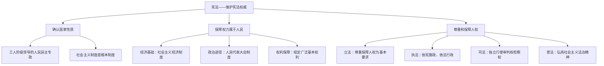

# 第一课 维护宪法权威

标签：#宪法至上 #国家性质 #人权保障

## 一、本知识点定位

统编版道德与法治八年级下册 **第一单元 坚持宪法至上 第一课 维护宪法权威**。本课包括「公民权利的保证书」和「治国安邦的总章程」两框，是整册书法治教育的逻辑起点。详细内容可参见 [[公民权利的保证书／治国安邦的总章程]]。

## 二、核心概念

1. **宪法**：国家的根本法，规定国家生活中带有全局性、根本性的问题，是治国安邦的总章程。
2. **国家性质**：我国是工人阶级领导的、以工农联盟为基础的人民民主专政的社会主义国家。
3. **国家一切权力属于人民**：这是我国宪法的基本原则。
4. **尊重和保障人权**：我国的宪法原则，人权的实质内容和目标是人的自由、平等地生存和发展。

## 三、知识框架

### 1. 宪法确认国家性质（是什么）

- 我国宪法第一条明确规定国家性质，社会主义制度是我国的根本制度。
- 中国共产党领导是中国特色社会主义最本质的特征。

### 2. 宪法保障权力属于人民（为什么）

- 宪法确认国家的一切权力属于人民，规定了人民行使国家权力的基本途径和形式。
- 宪法规定的社会主义经济制度奠定了国家权力属于人民的经济基础。
- 宪法规定的社会主义政治制度明确了人民行使国家权力的基本途径和形式。
- 宪法规定广泛的公民基本权利，并规定实现权利的保障措施。
- 一切权力属于人民的宪法原则，归根结底就是要保证人民当家作主。

### 3. 尊重和保障人权（怎么做）

- **立法**方面：尊重和保障人权成为立法活动的基本要求。
- **执法**方面：行政机关要坚持依宪施政、依法行政，做到严格规范公正文明执法。
- **司法**方面：审判机关、检察机关要依照宪法和法律独立行使审判权、检察权。
- **普法**方面：国家加强法治宣传教育，弘扬社会主义法治精神，增强全民法治观念。

## 四、案例分析

**案例**：某市政务服务中心推行"一网通办"，残疾人张先生在家即可办理低保申请；社区还为独居老人配备紧急呼叫设备。

**分析**：
- 体现了国家尊重和保障人权的宪法原则；
- 政府依宪施政，保障公民的物质帮助权等基本权利；
- 说明一切权力属于人民，国家机关努力为人民服务。

**答题思路**：材料中出现"政府便民措施、弱势群体保障"，一般从"尊重和保障人权""国家权力属于人民"角度作答。

## 五、背记要点

1. 我国宪法的两大基本原则：**国家一切权力属于人民**、**尊重和保障人权**。
2. 人权的主体很广泛：既包括我国公民，也包括外国人；既包括个人，也包括群体。
3. 人权的内容很广泛：包括平等权和人身权利、政治权利，也包括财产权、劳动权、受教育权等经济、社会、文化方面的权利。
4. 国家机关及其工作人员必须树立尊重和保障人权的理念。

## 六、易错提醒

- ❌"人权只属于中国公民" → ✅ 人权主体包括在中国境内的外国人。
- ❌"宪法只是普通法律之一" → ✅ 宪法是根本法，具有最高法律效力，后续在 [[第二课 保障宪法实施]] 中详细学习。

## 七、自测题

1. 我国的国家性质是什么？（工人阶级领导的、以工农联盟为基础的人民民主专政的社会主义国家）
2. 我国宪法的基本原则有哪些？（一切权力属于人民；尊重和保障人权）
3. 国家应如何做到尊重和保障人权？（立法、执法、司法、普法四个层面展开）
4. 人权的实质内容和目标是什么？（人的自由、平等地生存和发展）

## 八、关联知识

- 下一课：[[第二课 保障宪法实施]]，学习宪法为何具有至高地位。
- 具体展开：[[坚持依宪治国／加强宪法监督]]。
- 权利义务基础：[[第三课 公民权利]] 与 [[第四课 公民义务]] 都以宪法为根本依据。
