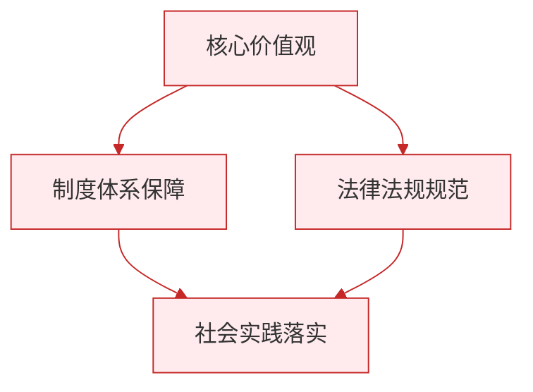

# 第二课 保障宪法实施

标签：#宪法至上 #依宪治国 #宪法监督

## 一、本知识点定位

统编版道德与法治八年级下册 **第一单元 坚持宪法至上 第二课 保障宪法实施**。本课包括「坚持依宪治国」和「加强宪法监督」两框，重点回答"宪法为什么至上、如何保证宪法实施"。详细展开见 [[坚持依宪治国／加强宪法监督]]。

## 二、核心概念

1. **根本的活动准则**：宪法是一切组织和个人的根本活动准则。
2. **最高法律效力**：宪法在国家法律体系中具有最高的法律地位、法律权威和法律效力。
3. **宪法监督**：全国人大及其常委会行使监督宪法实施的职权。
4. **宪法宣誓制度**：国家工作人员就职时应当依照法律规定公开进行宪法宣誓。

## 三、知识框架

### 1. 宪法为什么具有至高地位（为什么）

- **内容上**：宪法规定国家生活中最根本、最重要的问题，如国家性质、根本制度、根本任务等；其他法律只规定某一方面的问题。
- **效力上**：宪法是其他法律的立法基础和立法依据，其他法律是根据宪法制定的，不得与宪法相抵触，否则无效。
- **程序上**：宪法的制定和修改程序比其他法律更加严格。修改宪法须由全国人大常委会或1/5以上的全国人大代表提议，并由全国人大以全体代表的2/3以上多数通过。

### 2. 怎样保障宪法实施（怎么做）

- 完善以宪法为核心的中国特色社会主义法律体系。
- 健全宪法实施和监督制度，全国人大及其常委会加强宪法监督。
- 落实宪法解释程序机制，推进合宪性审查工作。
- 加强宪法宣传教育，增强公民宪法意识（国家宪法日：**12月4日**）。

### 3. 公民怎样增强宪法意识

- **学习**宪法：了解宪法的性质和基本内容，理解并认同宪法的价值。
- **认同**宪法：理解宪法价值，增强对宪法的信服和尊崇。
- **践行**宪法：坚持宪法至上，自觉抵制各种妨碍宪法实施、损害宪法尊严的行为。

## 四、案例分析

**案例**：新当选的市长手抚宪法进行宪法宣誓："我宣誓：忠于中华人民共和国宪法，维护宪法权威……"

**分析**：
- 宪法宣誓制度有利于强化国家工作人员的宪法意识；
- 彰显宪法权威，激励国家工作人员忠于宪法、维护宪法；
- 体现了坚持依宪治国、树立宪法权威的要求。

**答题思路**：见到"宪法宣誓、宪法日活动、合宪性审查"等素材，从"宪法具有最高法律效力""增强宪法意识""加强宪法监督"角度组织答案。

## 五、背记要点

1. 宪法与其他法律的三点区别：**内容**不同、**效力**不同、**制定和修改程序**不同。
2. 宪法是国家法制统一的基础，是党和人民意志的集中体现。
3. 全国人大及其常委会行使宪法监督职权；地方各级人大在本行政区域内保证宪法遵守和执行。
4. 每年12月4日为国家宪法日。

## 六、易错提醒

- ❌"宪法是所有法律的总和" → ✅ 宪法规定的是最根本、最重要的问题，不是普通法律的简单相加。
- ❌"宪法监督只是国家的事，与公民无关" → ✅ 公民也要增强宪法意识，自觉学习、认同、践行宪法。

## 七、自测题

1. 为什么说宪法具有最高的法律效力？（立法基础和依据；不得与宪法相抵触；修改程序更严格）
2. 修改宪法需要什么程序？（全国人大常委会或1/5以上代表提议，全体代表2/3以上多数通过）
3. 全国人大及其常委会在宪法监督方面有什么职权？（监督宪法实施，进行合宪性审查）
4. 青少年应怎样增强宪法意识？（学习宪法、认同宪法、践行宪法）

## 八、关联知识

- 前置知识：[[第一课 维护宪法权威]]，宪法的原则与核心价值。
- 内容展开：[[公民权利的保证书／治国安邦的总章程]]。
- 后续单元：宪法规定的权利义务见 [[第三课 公民权利]]、[[第四课 公民义务]]；宪法确认的制度见 [[第五课 我国基本制度]] 与 [[第六课 我国国家机构]]。

### 政治理论与逻辑框架

