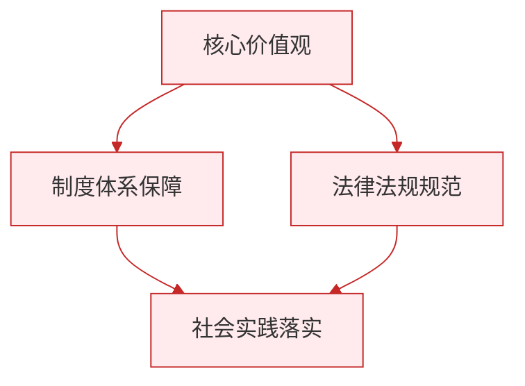

# 公民权利的保证书／治国安邦的总章程

标签：#宪法至上 #权力属于人民 #国家机构组织原则

## 一、本知识点定位

统编版道德与法治八年级下册 **第一课 维护宪法权威** 的两框内容：「公民权利的保证书」与「治国安邦的总章程」。前者讲宪法与公民的关系，后者讲宪法与国家机构的关系，是 [[第一课 维护宪法权威]] 的具体展开。

## 二、核心概念

1. **公民权利的保证书**：宪法通过确认国家权力属于人民、规定基本权利及其保障措施，成为公民权利的保证书。
2. **治国安邦的总章程**：宪法组织国家机构、规范权力运行，是治国安邦的总章程。
3. **民主集中制**：我国国家机构实行的组织和活动原则。
4. **法无授权不可为**：国家权力必须在宪法和法律限定的范围内行使。

## 三、知识框架

### 1. 公民权利的保证书

- 宪法确认我国的国家性质，明确人民当家作主的地位。
- 国家一切权力属于人民是我国宪法的基本原则：
  - 经济基础：社会主义经济制度（生产资料的社会主义公有制）；
  - 政治途径：人民代表大会制度等社会主义政治制度；
  - 权利保障：规定广泛的公民基本权利及实现保障；
  - 国防保障：武装力量属于人民。
- 尊重和保障人权是我国的宪法原则（主体广泛、内容广泛）。

### 2. 治国安邦的总章程

- **组织国家机构**：
  - 人民代表大会是人民行使国家权力的机关；
  - 国家行政机关、监察机关、审判机关、检察机关都由人民代表大会产生，对它负责，受它监督；
  - 我国国家机构实行民主集中制原则。
- **规范权力运行**：
  - 权力是把双刃剑，运用得好可造福人民，滥用则贻害无穷；
  - 宪法和法律规定国家权力行使的界限、方式和程序；
  - 国家权力必须依法行使，法定职责必须为、法无授权不可为。

## 四、案例分析

**案例**：某县环保局未按法定程序即对企业作出高额罚款，法院经审理撤销该处罚决定，并责令重新作出处理。

**分析**：
- 说明国家权力必须严格按照法定的途径和方式行使；
- 任何超越权限、滥用职权的行为都应承担法律责任；
- 体现宪法规范权力运行、防止权力滥用的作用。

**答题思路**：素材涉及"政府被判败诉、权力清单、程序违法被纠正"时，从"规范权力运行""依法行政"角度作答。

## 五、背记要点

1. 宪法是公民权利的**保证书**、治国安邦的**总章程**。
2. 人民代表大会与其他国家机关的关系：**产生、负责、监督**六字关系。
3. 民主集中制的两层含义：在民主基础上的集中和在集中指导下的民主相结合。
4. 规范权力运行的目的：保证人民赋予的权力始终用来为人民谋利益。

## 六、易错提醒

- ❌"国家机关可以做法律没有禁止的一切事" → ✅ 对国家机关而言是"法无授权不可为"；"法无禁止即可为"针对的是公民私权利。
- ❌"人民直接行使国家权力" → ✅ 人民通过人民代表大会间接行使国家权力。

## 七、自测题

1. 为什么说宪法是公民权利的保证书？（确认权力属于人民；规定基本权利；提供保障措施）
2. 我国国家机构实行什么组织原则？（民主集中制）
3. 宪法怎样规范权力运行？（规定界限、方式、程序；违法行使须担责）
4. "法定职责必须为、法无授权不可为"针对的对象是谁？（国家机关及其工作人员）

## 八、关联知识

- 宪法地位与监督：[[第二课 保障宪法实施]]、[[坚持依宪治国／加强宪法监督]]。
- 公民基本权利的具体内容：[[公民基本权利／依法行使权利]]。
- 国家机构的具体设置：[[第六课 我国国家机构]]、[[国家权力机关／中华人民共和国主席／国家行政机关／国家监察机关／国家司法机关]]。

### 政治理论与逻辑框架

