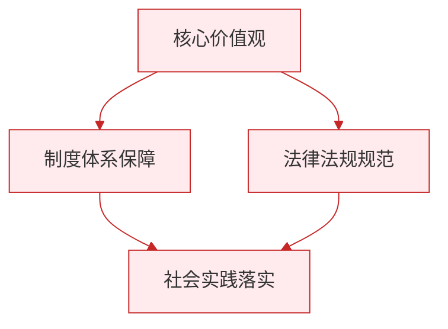

# 公民基本权利／依法行使权利

标签：#基本权利 #维权方式 #权利界限

## 一、本知识点定位

统编版道德与法治八年级下册 **第三课 公民权利** 的两框内容：「公民基本权利」与「依法行使权利」，是 [[第三课 公民权利]] 的具体展开，重点掌握权利清单、权利界限与维权途径。

## 二、核心概念

1. **基本权利体系**：政治权利和自由、人身自由、社会经济与文化教育权利，以及平等权、宗教信仰自由等。
2. **权利界限**：任何权利都是有范围的，不得损害国家的、社会的、集体的利益和其他公民的合法自由和权利。
3. **维权方式**：协商、调解、仲裁、诉讼。
4. **诉讼**：处理纠纷和应对侵害最正规、最权威的手段，是维护合法权益的最后屏障。

## 三、知识框架

### 1. 公民基本权利清单

- **政治权利和自由**：选举权和被选举权（基本政治权利）、政治自由、监督权。
- **人身自由**：人身自由不受侵犯、人格尊严不受侵犯（名誉、荣誉、肖像、姓名、隐私）、住宅不受侵犯、通信自由和通信秘密。
- **社会经济与文化教育权利**：财产权、劳动权、物质帮助权、受教育权、文化权利（科学研究、文艺创作等自由）。
- **其他**：平等权、宗教信仰自由，妇女、老人、儿童等特定人群权利受特殊保障。

### 2. 依法行使权利

- 行使权利**有界限**：不能滥用权利，不得损害国家、社会、集体利益和他人合法权益。
- 维护权利**守程序**：遵守正当的程序，按照法定的活动方式、步骤和过程进行。
  - **协商**：日常纠纷中快速、便捷的方式；
  - **调解**：人民调解、行政调解、司法调解；
  - **仲裁**：合同纠纷和其他财产权益争议可提请仲裁机构裁决；
  - **诉讼**：向人民法院起诉，最正规、最权威。

## 四、案例分析

**案例**：小区业主王女士网购到假冒商品，先与商家协商退货被拒，又向消费者协会投诉调解未果，最终向法院提起诉讼胜诉。

**分析**：
- 王女士依次采用协商、调解、诉讼等合法方式维权，程序正当；
- 说明公民维护权利要遵守正当程序，诉讼是最后屏障；
- 反面警示：如采取"网上恶意曝光他人隐私"等方式维权，则构成滥用权利。

**答题思路**："维权方式"类题目，先答"依法、按程序"，再按纠纷类型匹配协商→调解→仲裁→诉讼。

## 五、背记要点

1. 维权四方式：**协商、调解、仲裁、诉讼**（由和缓到正式）。
2. 诉讼三种类型：民事诉讼、行政诉讼（"民告官"）、刑事诉讼。
3. 权利界限一句话：个人自由和权利的行使不得损害国家的、社会的、集体的利益和其他公民合法的自由和权利。
4. 调解三种形式：人民调解、行政调解、司法调解。

## 六、易错提醒

- ❌"言论自由就是想说什么就说什么" → ✅ 政治自由有法律界限，造谣诽谤要承担法律责任。
- ❌"维权只能靠打官司" → ✅ 协商、调解、仲裁同样是合法有效的途径，诉讼是最后屏障。

## 七、自测题

1. 公民行使权利的界限是什么？（不得损害国家、社会、集体利益和他人合法自由权利）
2. 维护权利的四种方式是什么？（协商、调解、仲裁、诉讼）
3. 哪种维权手段最正规、最权威？（诉讼）
4. "民告官"属于哪类诉讼？（行政诉讼）

## 八、关联知识

- 总览：[[第三课 公民权利]]。
- 与义务对照学习：[[公民基本义务／依法履行义务]]、[[第四课 公民义务]]。
- 权利保障的宪法基础：[[公民权利的保证书／治国安邦的总章程]]。
- 自由的法律界限，还可联系 [[自由平等的真谛／自由平等的追求]]。

### 政治理论与逻辑框架

