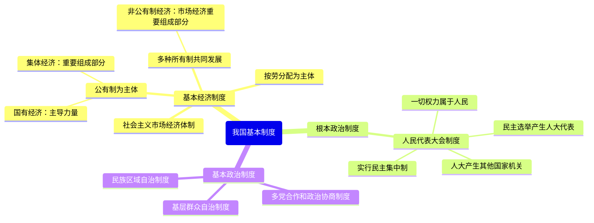

# 第五课 我国基本制度

标签：#基本经济制度 #人民代表大会制度 #基本政治制度

## 一、本知识点定位

统编版道德与法治八年级下册 **第三单元 人民当家作主 第五课 我国基本制度**。本课包括「基本经济制度」「根本政治制度」「基本政治制度」三框，详细展开见 [[基本经济制度／根本政治制度／基本政治制度]]。

## 二、核心概念

1. **基本经济制度**：公有制为主体、多种所有制经济共同发展，按劳分配为主体、多种分配方式并存，社会主义市场经济体制。
2. **根本政治制度**：人民代表大会制度，是我国的政体。
3. **基本政治制度**：中国共产党领导的多党合作和政治协商制度、民族区域自治制度、基层群众自治制度。
4. **公有制经济**：包括国有经济、集体经济，以及混合所有制经济中的国有成分和集体成分。

## 三、知识框架

### 1. 基本经济制度

- **公有制为主体**：国有经济是国民经济的主导力量；集体经济是公有制经济的重要组成部分。
- **多种所有制共同发展**：非公有制经济（个体、私营、外资等）是社会主义市场经济的重要组成部分。国家保护其合法权益，鼓励、支持、引导其发展。
- **分配制度**：按劳分配为主体、多种分配方式并存。
- **市场经济体制**：市场在资源配置中起决定性作用，更好发挥政府作用。

### 2. 根本政治制度：人民代表大会制度

- 基本内容：国家的一切权力属于人民；人民通过民主选举选出人大代表，组成各级人民代表大会；由人大产生其他国家机关；实行民主集中制。
- 地位：是我国的根本政治制度，是坚持党的领导、人民当家作主、依法治国有机统一的根本政治制度安排。

### 3. 三项基本政治制度

- **多党合作和政治协商制度**：共产党领导、多党派合作，共产党执政、多党派参政。
- **民族区域自治制度**：在国家统一领导下，各少数民族聚居的地方实行区域自治。
- **基层群众自治制度**：村民委员会、居民委员会是基层群众性自治组织。

## 四、案例分析

**案例**：全国人大会议期间，代表们审议政府工作报告并提出议案；全国政协委员围绕"双减"政策建言献策。

**分析**：
- 人大代表审议报告体现人民代表大会制度是人民当家作主的根本政治制度安排；
- 政协委员建言体现中国共产党领导的多党合作和政治协商制度；
- 两者共同保障人民当家作主。

**答题思路**：区分"人大"与"政协"——人大是国家权力机关（决定权），政协是协商机构（建言献策，不是国家机关序列的权力机关）。

## 五、背记要点

1. 一个根本政治制度：**人民代表大会制度**；三个基本政治制度：**政党制度、民族区域自治制度、基层群众自治制度**。
2. 国有经济的地位：国民经济的**主导力量**；公有制经济的地位：**主体**。
3. 对非公有制经济的方针：**鼓励、支持、引导**发展，依法**监管**。
4. 人民政协的两大主题：团结和民主；职能：政治协商、民主监督、参政议政。

## 六、易错提醒

- ❌"人民代表大会制度是基本政治制度" → ✅ 它是**根本**政治制度。
- ❌"政协是国家权力机关" → ✅ 政协是爱国统一战线组织、协商民主的重要渠道，不是国家机关。
- ❌"村委会是基层政府" → ✅ 村委会、居委会是基层群众性**自治组织**，不是国家机关。

## 七、自测题

1. 我国的基本经济制度包括哪些内容？（公有制为主体多种所有制共同发展；按劳分配为主体多种分配方式并存；社会主义市场经济体制）
2. 我国的根本政治制度是什么？（人民代表大会制度）
3. 三项基本政治制度分别是什么？（多党合作和政治协商制度、民族区域自治制度、基层群众自治制度）
4. 国有经济在国民经济中处于什么地位？（主导力量）

## 八、关联知识

- 具体展开：[[基本经济制度／根本政治制度／基本政治制度]]。
- 制度的宪法依据：[[第一课 维护宪法权威]]。
- 制度运行的载体：[[第六课 我国国家机构]]、[[国家权力机关／中华人民共和国主席／国家行政机关／国家监察机关／国家司法机关]]。
