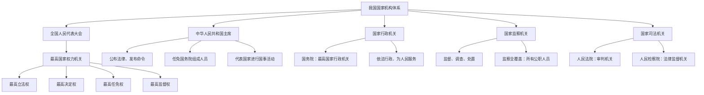

# 第六课 我国国家机构

标签：#国家机构 #民主集中制 #依法行政

## 一、本知识点定位

统编版道德与法治八年级下册 **第三单元 人民当家作主 第六课 我国国家机构**。本课介绍国家权力机关、国家主席、行政机关、监察机关、司法机关五类国家机构，详细展开见 [[国家权力机关／中华人民共和国主席／国家行政机关／国家监察机关／国家司法机关]]。

## 二、核心概念

1. **国家权力机关**：全国人民代表大会和地方各级人民代表大会。
2. **国家行政机关**：国务院和地方各级人民政府，是国家权力机关的执行机关。
3. **国家监察机关**：国家监察委员会和地方各级监察委员会，行使监察权。
4. **国家司法机关**：人民法院（审判机关）和人民检察院（法律监督机关）。
5. **民主集中制**：我国国家机构的组织和活动原则。

## 三、知识框架

### 1. 国家机构的体系

- 全国人民代表大会是**最高国家权力机关**，在国家机构中居于最高地位。
- 其他国家机关（行政、监察、审判、检察机关）都由人民代表大会产生，对它负责，受它监督。
- 中华人民共和国主席是我国的国家机构，代表国家进行国事活动。

### 2. 各机关的职权概览

- **人大**：立法权、决定权、任免权、监督权。
- **国家主席**：公布法律、发布命令、任免国务院组成人员、进行国事活动、代表国家接受外国使节等。
- **行政机关（政府）**：管理经济、社会事务等行政工作，必须依法行政。
- **监察机关**：对所有行使公权力的公职人员进行监察，调查职务违法和职务犯罪。
- **司法机关**：法院独立行使审判权，检察院独立行使检察权。

### 3. 组织活动原则：民主集中制

- 在国家机构与人民的关系上：国家机构由民主选举产生，对人民负责，受人民监督。
- 在中央和地方的关系上：中央统一领导，充分发挥地方主动性、积极性。
- 在国家机关内部：民主基础上的集中和集中指导下的民主相结合。

## 四、案例分析

**案例**：某市人大常委会听取市政府年度环保工作报告，并对整改不力的部门负责人进行质询；市监察委对一名收受贿赂的国企管理人员立案调查。

**分析**：
- 人大听取报告、质询体现权力机关对行政机关的监督（监督权）；
- 监察委立案调查体现监察机关对公职人员的监察全覆盖；
- 共同说明国家权力在监督下规范运行。

**答题思路**：先判断材料中的主体属于哪类国家机关，再对应其职权；注意"产生—负责—监督"链条。

## 五、背记要点

1. 人大四权口诀：**立、决、任、监**（立法权、决定权、任免权、监督权）。
2. 政府的角色：权力机关的**执行机关**，宗旨是为人民服务。
3. 监察委的监察对象：**所有行使公权力的公职人员**（监察全覆盖）。
4. 法院＝审判机关；检察院＝**法律监督机关**。

## 六、易错提醒

- ❌"政府是最高国家权力机关" → ✅ 全国人大才是最高国家权力机关，政府是执行机关。
- ❌"监察委只监督党员干部" → ✅ 监察对象是所有行使公权力的公职人员。
- ❌"法院对检察院负责" → ✅ 两者都由人大产生、对人大负责，彼此是分工配合、互相制约关系。

## 七、自测题

1. 我国的国家权力机关是什么？（全国人大和地方各级人大）
2. 人民代表大会有哪四项职权？（立法权、决定权、任免权、监督权）
3. 我国国家机构实行什么原则？该原则有哪三方面体现？（民主集中制；国家机构与人民、中央与地方、国家机关内部）
4. 人民检察院的性质是什么？（国家的法律监督机关）

## 八、关联知识

- 具体展开：[[国家权力机关／中华人民共和国主席／国家行政机关／国家监察机关／国家司法机关]]。
- 机构背后的制度：[[第五课 我国基本制度]]、[[基本经济制度／根本政治制度／基本政治制度]]。
- 机构设置的宪法依据：[[公民权利的保证书／治国安邦的总章程]]。
