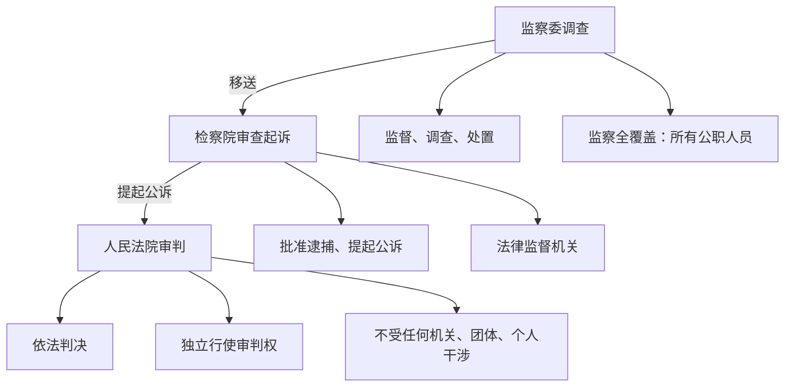

# 国家权力机关／中华人民共和国主席／国家行政机关／国家监察机关／国家司法机关

标签：#国家机关职权 #依法行政 #监察全覆盖 #司法公正

## 一、本知识点定位

统编版道德与法治八年级下册 **第六课 我国国家机构** 的五框内容，是 [[第六课 我国国家机构]] 的具体展开，逐一梳理五类国家机关的性质与职权。

## 二、核心概念

1. **国家权力机关**：全国人大及地方各级人大，人民行使国家权力的机关。
2. **国家主席**：代表中华人民共和国的国家机构，与全国人大常委会结合行使职权。
3. **国家行政机关**：国务院（最高国家行政机关）和地方各级人民政府。
4. **国家监察机关**：各级监察委员会，行使监察权的专责机关。
5. **国家司法机关**：人民法院（审判机关）、人民检察院（法律监督机关）。

## 三、知识框架

### 1. 国家权力机关（人大）

- 全国人大是**最高国家权力机关**，行使最高立法权、最高决定权、最高任免权、最高监督权。
- 地方各级人大是地方国家权力机关，保证宪法法律在本行政区域内的遵守和执行。

### 2. 中华人民共和国主席

- 由全国人大选举产生，任职条件：有选举权和被选举权的年满45周岁的中国公民。
- 职权：公布法律、发布命令；任免国务院总理等组成人员（根据全国人大及其常委会决定）；外事活动、授予国家勋章和荣誉称号；代表国家进行国事活动。

### 3. 国家行政机关（政府）

- 性质：国家权力机关的执行机关；国务院是最高国家行政机关。
- 职权：管理经济和社会事务，如制定行政法规、发布决定命令、管理教科文卫体等。
- 要求：**依法行政**（核心是规范政府的行政权），坚持为人民服务。

### 4. 国家监察机关（监察委）

- 性质：行使监察权的专责机关，独立行使监察权。
- 监察对象：所有行使公权力的公职人员（实现监察全覆盖）。
- 职责：**监督、调查、处置**。

### 5. 国家司法机关

- **人民法院**：国家的审判机关，依法独立公正行使审判权，任何机关、社会团体和个人不得干涉。
- **人民检察院**：国家的法律监督机关，依法独立行使检察权，如批准逮捕、提起公诉等。

## 四、案例分析

**案例**：某区监察委调查区住建局科长王某利用职务便利受贿的问题，调查终结后将其涉嫌犯罪问题移送人民检察院审查起诉，检察院向人民法院提起公诉，法院依法判处其有期徒刑。

**分析**：
- 监察委行使调查、处置职责，体现监察全覆盖；
- 检察院行使法律监督职权（审查起诉、提起公诉）；
- 法院独立行使审判权；三机关分工负责、互相配合、互相制约。

**答题思路**：办案流程题按"监察委调查→检察院起诉→法院审判"链条判断各机关职权，不可错位。

## 五、背记要点

1. 全国人大"四个最高"：最高立法权、最高决定权、最高任免权、最高监督权。
2. 国家主席任职条件：**年满45周岁**＋有选举权和被选举权的中国公民。
3. 监察委三职责：监督、调查、处置。
4. 依法行政的核心：规范政府的**行政权**。

## 六、易错提醒

- ❌"国务院可以制定法律" → ✅ 国务院制定的是**行政法规**，法律由全国人大及其常委会制定。
- ❌"检察院是审判机关" → ✅ 法院是审判机关，检察院是法律监督机关。
- ❌"监察委由政府领导" → ✅ 监察委由人大产生，对它负责，受它监督，独立行使监察权。

## 七、自测题

1. 全国人大行使哪些职权？（最高立法权、决定权、任免权、监督权）
2. 国家主席的职权有哪些？（公布法律发布命令、任免、外事、授勋、国事活动）
3. 监察委员会的三项职责是什么？（监督、调查、处置）
4. 人民法院行使审判权的原则是什么？（依法独立公正行使审判权，不受行政机关、社会团体和个人的干涉）

## 八、关联知识

- 总览：[[第六课 我国国家机构]]。
- 机构与制度的关系：[[第五课 我国基本制度]]、[[基本经济制度／根本政治制度／基本政治制度]]。
- 权力规范运行的宪法要求：[[公民权利的保证书／治国安邦的总章程]]。
- 司法机关守护公平正义，可联系 [[公平正义的价值／公平正义的守护]]。
