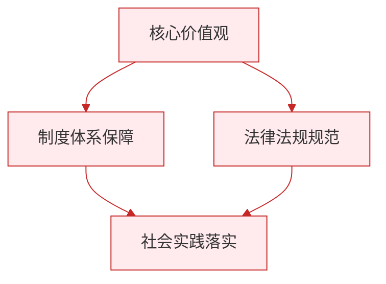

# 自由平等的真谛／自由平等的追求

标签：#自由的界限 #法律面前人人平等 #反对特权

## 一、本知识点定位

统编版道德与法治八年级下册 **第七课 尊重自由平等** 的两框内容：「自由平等的真谛」（是什么、为什么）与「自由平等的追求」（怎么做），是 [[第七课 尊重自由平等]] 的具体展开。

## 二、核心概念

1. **自由的真谛**：无论现实世界还是网络空间，自由都是法律之内的自由；自由的实现不能触碰法律的红线。
2. **法治与自由**：二者相互联系、不可分割，法治既规范自由又保障自由。
3. **平等的真谛**：同等情况同等对待；不同情况差别对待。法律面前人人平等。
4. **特权思想**：法律之外的特殊权利，是平等的大敌，必须反对和抵制。

## 三、知识框架

### 1. 自由平等的真谛（是什么／为什么）

- **自由的意义**：拥有自由能增强个人的幸福感，激发每个人的活力，推动社会的进步与繁荣。
- **自由的限制**：自由是有限制的、相对的，必要的限制是对自由的保护。
- **法治与自由的关系**：法治标定了自由的界限，自由的实现不能触碰法律红线；法治是自由的保障，人们合法的自由和权利不受非法干涉和侵害。
- **法律面前人人平等的表现**：
  - 任何公民平等地享有宪法法律规定的各项权利，平等地履行义务；
  - 我国公民的合法权益一律平等地受法律保护，违法或犯罪行为一律平等地依法予以追究。

### 2. 自由平等的追求（怎么做）

- **珍视自由**：
  - 珍惜宪法和法律赋予的权利，依法行使权利；
  - 必须依法维护自己的正当权益（正当途径：调解、仲裁、诉讼等）。
- **践行平等**：
  - 反对特权：拒绝"走后门""打招呼"等特权现象；
  - 平等对待他人的合法权利：尊重他人，不凌弱欺生；
  - 敢于抵制不平等的行为：面对就业歧视、地域歧视等，向有关部门举报或投诉；
  - 增强平等意识，把平等原则落实到日常生活中。

## 四、案例分析

**案例**：某公司招聘启事写明"只招男性、本地户籍优先"，求职者小丽向劳动监察部门投诉，该公司被责令改正。

**分析**：
- 招聘条件构成就业歧视，违背法律面前人人平等原则（同等情况未同等对待）；
- 小丽敢于抵制不平等行为，通过合法途径维权；
- 说明践行平等需要每个公民的行动，也需要法律的保障。

**答题思路**："歧视类"素材从"平等两层含义→指出歧视违背平等→公民如何抵制"三步作答。

## 五、背记要点

1. 自由的真谛：**法律之内的自由**（现实世界＋网络空间）。
2. 法治与自由关系八字：**标定界限、保障自由**。
3. 法律面前人人平等的两个"一律平等"：合法权益一律平等受保护；违法犯罪一律平等被追究。
4. 珍视自由两做法、践行平等四做法（反特权、平等待人、敢抵制、增强意识）。

## 六、易错提醒

- ❌"网络是自由空间，不受法律约束" → ✅ 网络空间的自由同样是法律之内的自由。
- ❌"对未成年人从轻处罚违反平等" → ✅ 这是"不同情况差别对待"，符合平等真谛。

## 七、自测题

1. 为什么说必要的限制是对自由的保护？（无限制的自由会侵害他人、扰乱秩序，最终失去自由）
2. 法律面前人人平等表现在哪两方面？（平等享有权利履行义务；权益平等受保护、违法平等被追究）
3. 公民如何珍视自由？（珍惜权利、依法行使权利、依法维护正当权益）
4. 面对就业歧视应该怎么办？（增强平等意识，依法向有关部门投诉举报，抵制不平等行为）

## 八、关联知识

- 总览：[[第七课 尊重自由平等]]。
- 权利行使的界限：[[公民基本权利／依法行使权利]]。
- 平等原则的宪法来源：[[第一课 维护宪法权威]]。
- 由自由平等走向公平正义：[[公平正义的价值／公平正义的守护]]。

### 政治理论与逻辑框架

