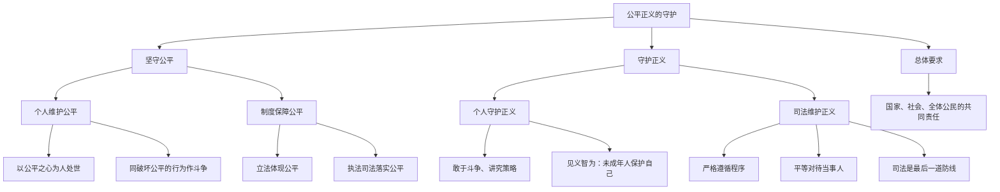

# 公平正义的价值／公平正义的守护

标签：#公平三内涵 #正义的价值 #见义智为 #司法防线

## 一、本知识点定位

统编版道德与法治八年级下册 **第八课 维护公平正义** 的两框内容：「公平正义的价值」（为什么）与「公平正义的守护」（怎么做），是 [[第八课 维护公平正义]] 的具体展开，也是全册知识的落脚点。

## 二、核心概念

1. **公平**：处理事情合情合理、不偏袒，涵盖权利公平、规则公平、机会公平。
2. **正义**：有利于促进社会进步、维护公共利益的行为；正义感是公民的基本德性。
3. **制度正义**：社会制度的程序与内容都应合乎正义，面向每一个社会成员。
4. **司法防线**：司法是捍卫社会公平正义的最后一道防线。

## 三、知识框架

### 1. 公平正义的价值（为什么）

- **公平的价值**：
  - 对个人：是个人生存和发展的重要保障，让人得到应得利益、感受安全、获得动力；
  - 对社会：是社会稳定和进步的重要基础，协调利益关系，缓和社会矛盾。
- **正义的价值**：
  - 正义是法治追求的基本价值目标之一，要求依法保障人们的正当权益；
  - 正义是社会制度的重要价值，制度的生命在于正义；
  - 正义是社会和谐的基本条件，帮助分清是非、惩恶扬善。

### 2. 公平正义的守护（怎么做）

- **坚守公平**：
  - 个人维护公平：以公平之心为人处世，同破坏公平的行为作斗争；
  - 制度保障公平：立法体现公平，执法司法落实公平，对损害公平的行为及时纠正。
- **守护正义**：
  - 个人守护正义：敢于斗争，讲究策略，寻求法律救助，做到见义"智"为；
  - 司法维护正义：司法机关必须严格遵循程序，平等对待当事人，确保司法过程和结果合法、公正；国家推进司法改革，让人民群众在每一个司法案件中感受到公平正义。
- **总体要求**：实现公平正义是国家、社会和全体公民的共同责任，需要每个人的参与和努力。

## 四、案例分析

**案例**：某地法院对一起冤错案件启动再审，宣告蒙冤者无罪并给予国家赔偿，同时追究相关办案人员责任。

**分析**：
- 纠正冤错案件体现司法维护正义，守住最后一道防线；
- 国家赔偿保障公民正当权益，体现正义是法治追求的基本价值目标；
- 追责体现制度对公平正义的刚性保障。

**答题思路**："司法纠错、阳光执法、扶贫助学"等素材都可落到"维护公平正义"的价值与做法上，注意区分个人层面与制度层面。

## 五、背记要点

1. 公平三内涵：**权利公平、规则公平、机会公平**。
2. 正义三价值：**法治目标、制度价值、和谐条件**。
3. 守护公平正义的两个层面：**个人**（担当、斗争、见义智为）＋**制度／司法**（立法执法司法保障）。
4. 名言点睛："一次不公正的审判，其恶果甚至超过十次犯罪。"——培根。

## 六、易错提醒

- ❌"见义勇为就要不顾一切冲上去" → ✅ 要敢于斗争更要讲究策略，未成年人应见义"智"为。
- ❌"公平正义只是司法机关的事" → ✅ 是国家、社会和全体公民的共同责任。

## 七、自测题

1. 公平对个人和社会分别有什么价值？（个人生存发展的重要保障；社会稳定进步的重要基础）
2. 为什么说正义是社会制度的重要价值？（制度的生命在于正义，程序与内容都应合乎正义）
3. 司法机关应如何维护正义？（严格遵循程序、平等对待当事人、确保过程和结果合法公正）
4. 青少年如何做公平正义的守护者？（以公平之心处世、敢于并善于同非正义行为作斗争、见义智为）

## 八、关联知识

- 总览：[[第八课 维护公平正义]]。
- 前置价值观：[[第七课 尊重自由平等]]、[[自由平等的真谛／自由平等的追求]]。
- 司法机关的职权基础：[[国家权力机关／中华人民共和国主席／国家行政机关／国家监察机关／国家司法机关]]。
- 公平正义的宪法保障：[[坚持依宪治国／加强宪法监督]]。
