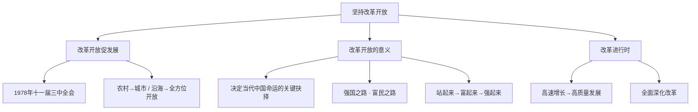

# 坚持改革开放

标签：#改革开放 #强国之路 #富民之路 #中考必考

## 一、本知识点定位

统编版道德与法治九年级上册 **第一单元 富强与创新 第一课 踏上强国之路 第一框**。本框是全册书的开篇，讲述改革开放的历史进程与重大意义，与下一框 [[走向共同富裕]] 共同构成"富强"主题。

## 二、核心概念

1. **改革开放**：1978年党的十一届三中全会开启的历史新时期，是决定当代中国命运的关键抉择。
2. **强国之路**：改革开放是我国的强国之路，是党和人民大踏步赶上时代的重要法宝。
3. **基本经济制度**：公有制为主体、多种所有制经济共同发展，按劳分配为主体、多种分配方式并存，社会主义市场经济体制。
4. **"两个毫不动摇"**：毫不动摇巩固和发展公有制经济，毫不动摇鼓励、支持、引导非公有制经济发展。

## 三、知识框架

### 1. 改革开放促发展（历程与作用）

- 1978年党的十一届三中全会作出把党和国家工作中心转移到经济建设上来、实行改革开放的历史性决策。
- 改革先从农村开始（家庭联产承包责任制），后转向城市（国有企业改革），从沿海开放到全方位开放。
- 改革开放极大解放和发展了社会生产力，使中国人民富起来、中国强起来。

### 2. 改革开放的意义（为什么）

- 改革开放是决定当代中国命运的关键抉择，是当代中国最鲜明的特色。
- 中国已成为世界第二大经济体、制造业第一大国，对世界经济增长贡献率超过30%。
- 中国人民通过改革开放过上了幸福生活，实现了从站起来、富起来到强起来的伟大飞跃。

### 3. 改革进行时（怎么做）

- 我国经济已由高速增长阶段转向高质量发展阶段。
- 全面深化改革，弘扬改革创新精神，将改革进行到底。
- 促进区域协调发展，坚持中国特色新型城镇化道路，坚持城乡融合发展。

## 四、案例分析

**案例**：深圳从一个小渔村发展为国际化创新型城市，GDP从1980年的2.7亿元增长到超过3万亿元，被称为"中国改革开放的窗口"。

**分析**：
- 说明改革开放是强国之路、富民之路；
- 体现改革开放极大解放和发展了社会生产力；
- 深圳的成功得益于坚持社会主义市场经济体制和对外开放政策。

**答题思路**：材料出现"经济特区、发展成就、对外开放"，一般从"改革开放的意义、坚持全面深化改革"角度作答。

## 五、背记要点

1. 改革开放的起点：**1978年党的十一届三中全会**。
2. 改革开放是**决定当代中国命运的关键抉择**，是**强国之路、富民之路**。
3. 党领导人民走上了以经济建设为中心的社会主义现代化建设道路。
4. 我国经济发展进入新常态，已由高速增长阶段转向**高质量发展**阶段。
5. 改革只有进行时，没有完成时。

## 六、易错提醒

- ❌"改革开放已经完成" → ✅ 改革只有进行时，没有完成时，需要全面深化改革。
- ❌"以经济建设为中心就是只抓经济" → ✅ 坚持以经济建设为中心，同时统筹推进"五位一体"总体布局。
- ❌"非公有制经济不重要" → ✅ 坚持"两个毫不动摇"，非公有制经济是社会主义市场经济的重要组成部分。

## 七、自测题

1. 改革开放开始的标志是什么？（1978年党的十一届三中全会）
2. 为什么说改革开放是强国之路？（解放和发展生产力，使中国大踏步赶上时代，实现从站起来、富起来到强起来的飞跃）
3. 我国的基本经济制度是什么？（公有制为主体、多种所有制经济共同发展等）
4. 我国经济发展进入了怎样的新阶段？（由高速增长转向高质量发展）

## 八、关联知识

- 下一框：[[走向共同富裕]]，学习发展成果如何惠及全体人民。
- 同单元：[[创新改变生活]] 与 [[创新永无止境]]，创新是改革开放的生命。
- 后续呼应：[[共圆中国梦]]，改革开放是实现中国梦的重要法宝。
