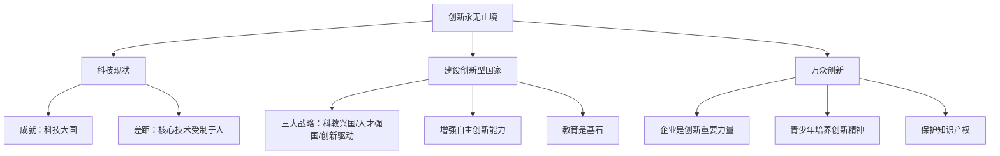

# 创新永无止境

标签：#创新型国家 #科教兴国 #自主创新 #中考高频

## 一、本知识点定位

统编版道德与法治九年级上册 **第一单元 富强与创新 第二课 创新驱动发展 第二框**。本框承接 [[创新改变生活]]，讲述建设创新型国家的原因和做法，以及万众创新的时代要求。

## 二、核心概念

1. **创新型国家**：以创新驱动为主要发展方式的国家，科技进步贡献率高、自主创新能力强。
2. **科教兴国战略**：把科技和教育摆在经济社会发展的重要位置，增强国家的科技实力。
3. **自主创新能力**：关键核心技术要不来、买不来、讨不来，必须自力更生。
4. **知识产权保护**：尊重创造、保护创新的法律保障，激发全社会创新活力。

## 三、知识框架

### 1. 我国科技现状（为什么要建设创新型国家）

- 成就：我国在载人航天、探月探火、量子信息、超级计算等领域取得重大突破，成为有世界影响力的科技大国。
- 差距：我国仍面临科技创新能力不强、关键核心技术受制于人等问题，整体上仍处于全球价值链中低端。
- 结论：中国科技创新之路任重道远，需要加快建设创新型国家。

### 2. 建设创新型国家（怎么做——国家层面）

- 落实**科教兴国战略、人才强国战略、创新驱动发展战略**。
- 增强自主创新能力，坚持自主创新、重点跨越、支撑发展、引领未来的方针。
- 必须加快形成有利于创新的治理格局和协同机制，搭建创新平台。
- 百年大计，教育为本：教育是民族振兴、社会进步的基石。

### 3. 万众创新（怎么做——个人与社会层面）

- 每个人都是创新者，青少年要培养创新精神和实践能力，敢于质疑、勇于探索。
- 企业是社会创新的重要力量，要自强奋斗、敢于突破，掌握核心技术。
- 弘扬创新精神：改革创新是时代精神的核心。
- 保护知识产权就是尊重创造、保护创新，我们要学会尊重他人的知识产权。

## 四、案例分析

**案例**：某科技企业遭遇国外"芯片断供"后，投入巨资自主研发操作系统与芯片，最终实现关键技术突破。

**分析**：
- 说明关键核心技术要不来、买不来、讨不来，必须增强自主创新能力；
- 体现企业是社会创新的重要力量；
- 启示我国要落实创新驱动发展战略，加快建设创新型国家。

**答题思路**：材料出现"卡脖子、自主研发、核心技术"，一般从"自主创新、创新型国家、科教兴国"角度作答。

## 五、背记要点

1. 建设创新型国家要落实**科教兴国战略、人才强国战略、创新驱动发展战略**。
2. 教育是民族振兴、社会进步的**基石**，是提高国民素质、培养创新型人才的根本途径。
3. 关键核心技术必须**自主创新**，自力更生是中华民族奋斗的基点。
4. 企业是社会创新的重要力量，时代需要弘扬创新精神。
5. 保护**知识产权**就是尊重创造、保护创新。

## 六、易错提醒

- ❌"我国已经是创新强国" → ✅ 我国是有世界影响力的科技大国，但创新能力仍需提升，正在建设创新型国家。
- ❌"创新靠引进国外技术就行" → ✅ 关键核心技术要不来、买不来、讨不来，必须自主创新。
- ❌"教育与创新无关" → ✅ 教育是培养创新型人才、提高国民素质的根本途径。

## 七、自测题

1. 建设创新型国家需要实施哪三大战略？（科教兴国战略、人才强国战略、创新驱动发展战略）
2. 为什么重视教育？（教育是民族振兴、社会进步的基石，是培养创新人才的根本途径）
3. 青少年怎样培养创新精神？（敢于质疑、勇于探索、努力学习、参加实践活动等）
4. 为什么要保护知识产权？（保护知识产权就是尊重创造、保护创新，激发全社会创新活力）

## 八、关联知识

- 上一框：[[创新改变生活]]，先明确创新的重要性，再学习创新的路径。
- 同单元：[[坚持改革开放]]，改革为创新提供制度动力。
- 后续呼应：[[正视发展挑战]]，创新是破解发展难题的关键。
