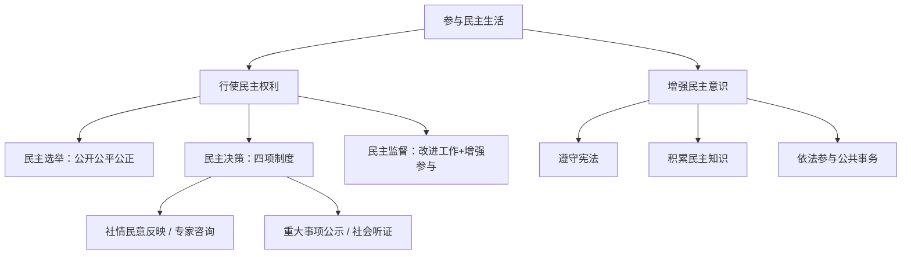

# 参与民主生活

标签：#民主权利 #民主参与 #民主意识 #中考高频

## 一、本知识点定位

统编版道德与法治九年级上册 **第二单元 民主与法治 第三课 追求民主价值 第二框**。本框承接 [[生活在民主国家]]，从公民角度讲述行使民主权利的形式和增强民主意识的要求。

## 二、核心概念

1. **民主选举**：公民参与民主生活、行使民主权利的重要形式，包括直接选举与间接选举、等额选举与差额选举。
2. **民主决策**：保障人民利益得到充分实现的有效方式，要求决策科学化、民主化。
3. **民主监督**：公民对国家机关及其工作人员的监督，是公民参与民主生活的重要方式。
4. **民主意识**：公民对民主价值的认同以及参与民主生活的自觉性。

## 三、知识框架

### 1. 行使民主权利（三种形式）

- **民主选举**：要遵循公开、公平、公正的原则；公民要积极、主动、理性地参与。
- **民主决策**：社情民意反映制度、专家咨询制度、重大事项社会公示制度、社会听证制度是保证决策科学化民主化的重要环节。
- **民主监督**：有利于国家机关及其工作人员改进工作、提高效率；有利于增强公民的参与意识、激发公民的参与热情。

### 2. 增强民主意识（为什么）

- 在我国，塑造现代公民，需要增强民主意识。
- 增强公民的民主意识，有利于完善中国特色社会主义民主，也是社会主义制度生命力的重要保证。
- 公民参与是社会主义民主的要求，也是公民的一项权利。

### 3. 增强民主意识（怎么做）

- 公民要自觉遵守宪法，始终按照宪法原则和精神参与民主生活。
- 公民要不断积累民主知识，形成尊重、宽容、批判和协商的民主态度。
- 公民要通过依法参与公共事务，在实践中逐步增强民主意识。

## 四、案例分析

**案例**：某市地铁票价调整前召开听证会，市民代表、专家、运营方各抒己见；中学生小林通过市长热线对调价方案提出建议并被采纳。

**分析**：
- 听证会体现民主决策中的社会听证制度；
- 小林的行为是依法参与公共事务、行使民主权利的表现；
- 说明公民要以理性、积极的态度参与民主生活。

**答题思路**：材料出现"听证会、建言献策、举报监督"，分别对应"民主决策、民主监督"等知识点。

## 五、背记要点

1. 公民参与民主生活的三种形式：**民主选举、民主决策、民主监督**。
2. 民主选举的原则：**公开、公平、公正**。
3. 民主决策的四项制度：社情民意反映制度、专家咨询制度、重大事项社会公示制度、社会听证制度。
4. 民主监督的意义：促进国家机关改进工作＋增强公民参与意识。
5. 增强民主意识三要求：遵守宪法、积累民主知识、依法参与公共事务。

## 六、易错提醒

- ❌"未成年人与民主生活无关" → ✅ 中学生也可通过合法渠道建言献策、参与监督。
- ❌"民主监督可以采取任何方式" → ✅ 必须依法行使监督权，不得捏造、歪曲事实。
- ❌"选举只指选国家领导人" → ✅ 还包括人大代表选举、村（居）委会选举等。

## 七、自测题

1. 公民参与民主生活有哪三种主要形式？（民主选举、民主决策、民主监督）
2. 保证决策科学化、民主化的制度有哪些？（社情民意反映、专家咨询、重大事项社会公示、社会听证）
3. 实行民主监督有什么意义？（促使国家机关改进工作；增强公民参与意识和热情）
4. 公民怎样增强民主意识？（遵守宪法；积累民主知识、形成民主态度；依法参与公共事务）

## 八、关联知识

- 上一框：[[生活在民主国家]]，先了解民主制度，再学习民主参与。
- 下一课：[[夯筑法治基石]]，民主生活需要法治保障。
- 呼应：[[凝聚法治共识]] 中"厉行法治对公民的要求"。
