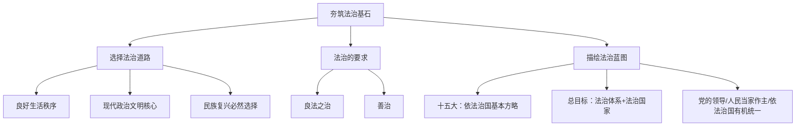

# 夯筑法治基石

标签：#法治 #依法治国 #良法善治 #中考必考

## 一、本知识点定位

统编版道德与法治九年级上册 **第二单元 民主与法治 第四课 建设法治中国 第一框**。本框讲述法治的内涵、要求和全面依法治国的意义，与下一框 [[凝聚法治共识]] 共同回答"如何建设法治中国"。

## 二、核心概念

1. **法治**：依法对国家和社会事务进行治理，强调依法治国、法律至上，要求任何组织和个人都要服从法律、遵守法律、依法办事。
2. **良法**：反映最广大人民群众的意愿和利益，反映社会发展的规律，维护公民的基本权利，符合公平正义要求，促进人与社会的共同发展。
3. **善治**：法治建立在民主政治基础上，通过赋予公民更多参与公共活动的机会和权利，实现公共利益最大化。
4. **全面依法治国**：中国特色社会主义的本质要求和重要保障，是"四个全面"战略布局的重要内容。

## 三、知识框架

### 1. 选择法治道路（为什么）

- 法治能够为人们提供良好的生活秩序，让人们安全、有尊严地生活。
- 法治是现代政治文明的核心，是发展市场经济、实现强国富民的基本保障。
- 法治是解决社会矛盾、维护社会稳定、实现社会正义的有效方式。
- 走法治道路是实现中华民族伟大复兴的必然选择。

### 2. 法治的要求

- 法治要求实行**良法之治**：有法律制度不等于就有法治，法治还必须是良法。
- 法治还要求实行**善治**：让公民参与公共活动，实现公共利益的最大化。

### 3. 描绘法治蓝图（怎么做）

- 党的十五大把依法治国确定为党领导人民治理国家的基本方略。
- 党的十八届四中全会作出全面推进依法治国的重大决策，提出总目标：**建设中国特色社会主义法治体系，建设社会主义法治国家**。
- 全面依法治国必须坚持党的领导、人民当家作主、依法治国有机统一。
- 建设法治中国，要努力使每一项立法都得到人民群众的普遍拥护，使每一部法律法规都得到严格执行，使每一个司法案件都体现公平正义，使每一个公民都成为法治的忠实崇尚者、自觉遵守者、坚定捍卫者。

## 四、案例分析

**案例**：《中华人民共和国民法典》编纂过程中先后10次公开征求意见，收到102万余条建议，被称为"人民的法典"。

**分析**：
- 体现良法反映最广大人民群众的意愿和利益；
- 立法广泛听取民意，是科学立法、民主立法的表现；
- 说明全面依法治国坚持人民当家作主与依法治国的统一。

**答题思路**：材料出现"立法征求意见、法典颁布"，一般从"良法之治、科学立法"角度作答。

## 五、背记要点

1. 法治要求：**实行良法之治 + 实行善治**。
2. 全面推进依法治国总目标：**建设中国特色社会主义法治体系，建设社会主义法治国家**。
3. 依法治国是党领导人民治理国家的**基本方略**。
4. 走法治道路是实现中华民族伟大复兴的**必然选择**。
5. 坚持党的领导、人民当家作主、依法治国**有机统一**。

## 六、易错提醒

- ❌"有法律就是有法治" → ✅ 有法律制度不等于有法治，法治必须是良法之治、善治。
- ❌"法治与民主无关" → ✅ 法治建立在民主政治基础上，民主与法治相辅相成，参见 [[生活在民主国家]]。
- ❌"依法治国的总目标是依法行政" → ✅ 总目标是建设中国特色社会主义法治体系，建设社会主义法治国家。

## 七、自测题

1. 法治的两大要求是什么？（实行良法之治；实行善治）
2. 什么是良法？（反映最广大人民意愿和利益、反映社会发展规律、维护公民基本权利、符合公平正义）
3. 全面推进依法治国的总目标是什么？（建设中国特色社会主义法治体系，建设社会主义法治国家）
4. 为什么要选择法治道路？（提供良好生活秩序；现代政治文明核心；强国富民基本保障；民族复兴必然选择）

## 八、关联知识

- 下一框：[[凝聚法治共识]]，学习法治政府与全民守法。
- 同单元：[[参与民主生活]]，公民民主参与需在法治轨道上进行。
- 前置基础：八年级下册宪法知识是法治学习的根基。
