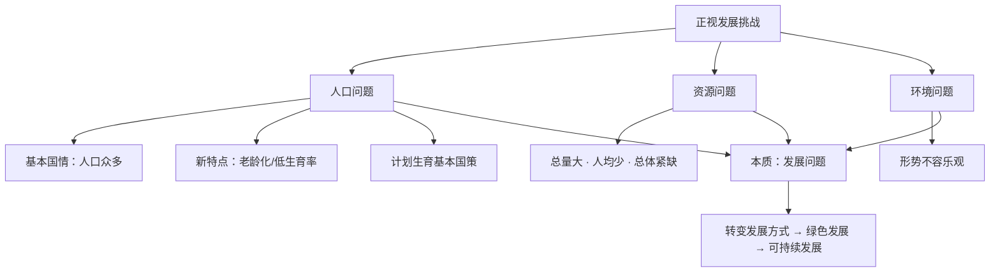

# 正视发展挑战

标签：#人口问题 #资源环境 #基本国策 #中考高频

## 一、本知识点定位

统编版道德与法治九年级上册 **第三单元 文明与家园 第六课 建设美丽中国 第一框**。本框讲述我国的人口、资源、环境形势，与下一框 [[共筑生命家园]] 共同回答"如何建设美丽中国"。

## 二、核心概念

1. **人口基本国情**：我国是世界上人口众多的国家，人口众多是我国的基本国情。
2. **计划生育基本国策**：使人口的增长同经济和社会发展计划相适应。
3. **资源形势**：自然资源丰富、总量大、种类多，但人均资源占有量少、开发难度大、总体上资源紧缺。
4. **环境形势**：环境形势不容乐观，大气、水、土壤污染等问题依然存在。

## 三、知识框架

### 1. 发展中的人口问题

- 人口特点：人口众多（基本国情）；新特点——总人口增速趋缓、总和生育率低于更替水平、老龄化加剧、大量人口流动等。
- 人口问题的影响：人口问题始终是我国面临的全局性、长期性、战略性问题，加重资源环境压力，带来严峻的社会问题。
- 政策调整：坚持计划生育基本国策，国家推行一对夫妻可以生育三个子女政策及配套支持措施，促进人口长期均衡发展。

### 2. 资源环境面临危机

- 资源现状：总量大、种类多，但**人均少、开发难度大、总体紧缺**；长期以来资源开发利用粗放、浪费严重。
- 环境现状：环境形势不容乐观，环境恶化加剧自然灾害的发生，威胁生态平衡和人民的生命安全与身体健康。
- 原因：一些地方发展方式粗放，牺牲环境换取经济增长。

### 3. 转变发展方式（怎么办）

- 人口、资源、环境问题本质上是**发展问题**。
- 必须坚持**节约资源和保护环境的基本国策**。
- 转变发展方式，坚持走**绿色发展道路**，建设资源节约型、环境友好型社会，实现可持续发展。

## 四、案例分析

**案例**：某地曾依靠开采矿山快速致富，但导致植被破坏、河流污染；后来关停矿场、复绿矿山，发展生态旅游，实现"绿水青山"与"金山银山"双赢。

**分析**：
- 说明以牺牲环境为代价的发展不可持续；
- 体现坚持节约资源和保护环境的基本国策，走绿色发展道路；
- 印证"绿水青山就是金山银山"的理念（详见 [[共筑生命家园]]）。

**答题思路**：材料出现"污染治理、资源浪费、老龄化"，分别从"环境国策、资源国情、人口政策"角度作答。

## 五、背记要点

1. 人口基本国情：**世界上人口众多的国家**；人口问题是全局性、长期性、战略性问题。
2. 我国资源国情：总量大、种类多，**人均少、开发难度大、总体紧缺**。
3. 两大基本国策：**计划生育**基本国策；**节约资源和保护环境**基本国策。
4. 人口、资源、环境问题本质上是**发展问题**。
5. 出路：转变发展方式，走绿色发展道路，实现可持续发展。

## 六、易错提醒

- ❌"实行三孩政策意味着放弃计划生育" → ✅ 生育政策调整完善是坚持计划生育基本国策的体现。
- ❌"我国资源总量大，所以不缺资源" → ✅ 人均占有量少，总体上资源紧缺。
- ❌"先发展经济，再治理环境" → ✅ 决不能走"先污染后治理"的老路。

## 七、自测题

1. 我国的人口国情和人口新特点是什么？（人口众多；增速趋缓、老龄化加剧、生育率低等）
2. 我国的资源现状如何？（总量大、种类多；人均少、开发难度大、总体紧缺）
3. 面对人口资源环境问题应坚持哪些基本国策？（计划生育；节约资源和保护环境）
4. 人口、资源、环境问题的本质是什么？（发展问题）

## 八、关联知识

- 下一框：[[共筑生命家园]]，学习人与自然和谐共生、绿色发展道路。
- 呼应：[[创新永无止境]]，科技创新助力破解资源环境约束。
- 大局观：[[我们的梦想]]，美丽中国是社会主义现代化强国目标的重要内容。
