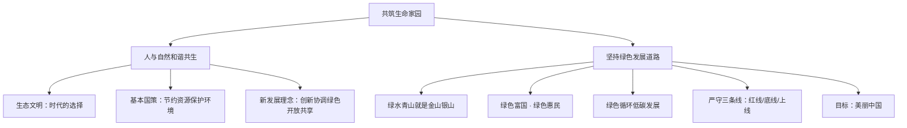

# 共筑生命家园

标签：#人与自然和谐共生 #绿色发展 #生态文明 #中考高频

## 一、本知识点定位

统编版道德与法治九年级上册 **第三单元 文明与家园 第六课 建设美丽中国 第二框**。本框承接 [[正视发展挑战]]，讲述人与自然和谐共生的理念与绿色发展道路。

## 二、核心概念

1. **人与自然和谐共生**：人类开发和利用自然必须遵循自然规律，与自然和谐相处。
2. **生态文明**：人类对传统文明形态特别是工业文明进行深刻反思的成果，是人与自然和谐共生的文明形态。
3. **绿色发展**：以节约资源和保护环境为前提的可持续发展方式。
4. **"两山"理念**：绿水青山就是金山银山。

## 三、知识框架

### 1. 坚持人与自然和谐共生（为什么、怎么做）

- 为什么：追求人与自然和谐共生是人类面对生态危机作出的智慧选择；自然为人类提供滋养和必要条件，人类也应善待自然。
- 生态文明作为一种新型的社会文明形态，是人类的共识，也是时代的选择。
- 怎么做：要坚持节约资源和保护环境的基本国策，使青山常在、绿水长流、空气常新；坚持创新、协调、绿色、开放、共享的新发展理念，实现中华民族永续发展。

### 2. 坚持绿色发展道路（怎么做）

- 处理好经济发展与生态环境保护的关系：绿水青山就是金山银山，决不能以牺牲环境为代价换取一时的经济增长。
- 坚持绿色富国、绿色惠民，让人民群众切实感受到经济发展带来的环境效益。
- 走绿色、循环、低碳发展之路：倡导节能、环保、低碳、文明的绿色生产生活方式，让绿色发展理念渗透到人们日常生活细节中。
- 严守生态保护红线、环境质量底线、资源利用上线，实行最严格的制度、最严密的法治。
- 目标：建设生态文明，建成人与自然和谐共生的美丽中国。

### 3. 美丽中国的愿景

- 美丽中国不仅是山清水秀、天蓝地绿，还是留住乡愁、守望相助的家园。
- 建设美丽中国，需要每个人从点滴小事做起，如绿色出行、垃圾分类、节水节电。

## 四、案例分析

**案例**：浙江省安吉县余村曾靠开山采矿致富但环境恶化，后关停矿山、修复生态，发展竹海旅游与生态农业，成为"绿水青山就是金山银山"理念的诞生地。

**分析**：
- 说明保护生态环境就是保护生产力，改善生态环境就是发展生产力；
- 体现坚持绿色发展道路，处理好经济发展与生态保护的关系；
- 印证决不能以牺牲环境为代价换取一时的经济增长。

**答题思路**：材料出现"生态旅游、退耕还林、碳达峰碳中和"，一般从"绿色发展、两山理念、和谐共生"角度作答。

## 五、背记要点

1. 核心理念：**绿水青山就是金山银山**。
2. 新发展理念：**创新、协调、绿色、开放、共享**。
3. 走**绿色、循环、低碳**发展之路。
4. 严守"三条线"：生态保护红线、环境质量底线、资源利用上线。
5. 建设美丽中国的时代图景：**人与自然和谐共生**。

## 六、易错提醒

- ❌"经济发展必然破坏环境" → ✅ 保护环境与发展经济可以统一，绿水青山就是金山银山。
- ❌"建设美丽中国只是政府的事" → ✅ 需要全社会共同参与，个人也要践行绿色生活方式。
- ❌"绿色发展就是不发展" → ✅ 绿色发展是更高质量、可持续的发展方式。

## 七、自测题

1. 为什么坚持人与自然和谐共生？（生态危机的智慧选择；自然滋养人类，人类应善待自然）
2. 怎样走绿色发展道路？（处理好发展与保护关系；绿色富国惠民；绿色循环低碳；最严格制度最严密法治）
3. 新发展理念的内容是什么？（创新、协调、绿色、开放、共享）
4. 中学生能为建设美丽中国做什么？（绿色出行、垃圾分类、节约水电、宣传环保等）

## 八、关联知识

- 上一框：[[正视发展挑战]]，先认识问题，再寻求出路。
- 呼应：[[我们的梦想]]，"美丽"是社会主义现代化强国的重要目标。
- 创新支撑：[[创新永无止境]]，绿色技术创新推动低碳转型。
