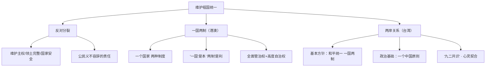

# 维护祖国统一

标签：#国家统一 #一国两制 #反对分裂 #中考高频

## 一、本知识点定位

统编版道德与法治九年级上册 **第四单元 和谐与梦想 第七课 中华一家亲 第二框**。本框承接 [[促进民族团结]]，讲述反对分裂的要求与"一国两制"方针、两岸关系。

## 二、核心概念

1. **反对分裂**：维护国家统一、国家主权和领土完整，反对一切形式的民族分裂活动。
2. **"一国两制"**：一个国家，两种制度。在一个中国的前提下，国家的主体坚持社会主义制度，香港、澳门保持原有的资本主义制度长期不变。
3. **一个中国原则**：两岸关系的政治基础，世界上只有一个中国，台湾是中国领土不可分割的一部分。
4. **"九二共识"**：海峡两岸同属一个中国的共识，是两岸协商谈判的基础。

## 三、知识框架

### 1. 反对分裂（为什么、怎么做）

- 分裂会导致社会动荡、经济发展停滞不前，各族人民都会遭殃。
- 维护国家统一，反对分裂，是爱国主义精神的具体体现，是每个公民义不容辞的责任。
- 反对分裂，就要维护国家主权、领土完整和国家安全；就要反对一切形式的民族分裂活动，尤其要坚决反对借民族和宗教之名搞暴力恐怖活动。
- 国家安全是安邦定国的重要基石，维护国家安全人人有责。

### 2. "一国两制"（港澳）

- 香港、澳门回归祖国以来，保持长期繁荣稳定，"一国两制"实践取得举世公认的成功。
- 必须把维护中央对特别行政区全面管治权和保障特别行政区高度自治权有机结合起来。
- 坚守"一国"之本，善用"两制"之利，是港澳长期繁荣稳定的根本保障。

### 3. 两岸关系（台湾）

- 解决台湾问题的基本方针：**"和平统一、一国两制"**。
- 两岸关系的政治基础：坚持**一个中国原则**。
- "九二共识"明确界定了两岸关系的根本性质。
- 两岸同胞同根同源、同文同种，是命运与共的骨肉兄弟，要推动两岸经济文化交流合作，促进心灵契合。

## 四、案例分析

**案例**：港珠澳大桥建成通车，粤港澳大湾区建设加快推进，港澳居民在内地就业、就学享受更多便利。

**分析**：
- 体现"一国两制"下内地与港澳优势互补、共同发展；
- 有利于港澳融入国家发展大局，保持长期繁荣稳定；
- 说明祖国始终是港澳发展的坚强后盾。

**答题思路**：材料出现"港澳发展、两岸交流、反分裂斗争"，一般从"一国两制、一个中国原则、维护国家统一"角度作答。

## 五、背记要点

1. 解决台湾问题的基本方针：**"和平统一、一国两制"**。
2. 两岸关系的政治基础：**一个中国原则**。
3. "一国两制"：一个国家，两种制度；"一国"是本，"两制"是利。
4. 维护国家统一、反对分裂是每个公民**义不容辞的责任**。
5. 两岸同胞是**命运与共的骨肉兄弟**，要促进心灵契合。

## 六、易错提醒

- ❌"台湾问题可以由外部势力干涉" → ✅ 台湾问题纯属中国内政，任何外部势力无权干涉。
- ❌"'一国两制'意味着港澳完全自治" → ✅ 是中央全面管治权下的高度自治，不是完全自治。
- ❌"维护国家安全只是国家机关的事" → ✅ 维护国家安全人人有责。

## 七、自测题

1. 解决台湾问题的基本方针是什么？（"和平统一、一国两制"）
2. 两岸关系的政治基础是什么？（坚持一个中国原则）
3. 为什么要反对分裂？（分裂导致社会动荡、经济停滞；维护统一是公民责任）
4. 怎样理解"一国两制"？（一个中国前提下，主体坚持社会主义，港澳保持资本主义制度长期不变）

## 八、关联知识

- 上一框：[[促进民族团结]]，民族团结与祖国统一同为国家发展基石。
- 呼应：[[凝聚价值追求]]，爱国主义是维护统一的精神动力。
- 大局：[[共圆中国梦]]，祖国完全统一是中华民族根本利益所在。
