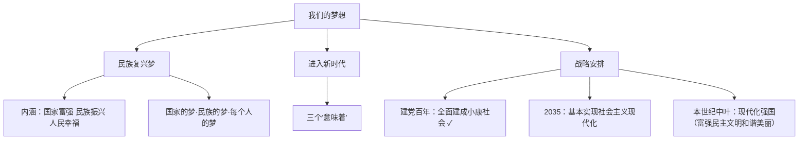

# 我们的梦想

标签：#中国梦 #两个一百年 #新时代 #中考高频

## 一、本知识点定位

统编版道德与法治九年级上册 **第四单元 和谐与梦想 第八课 中国人 中国梦 第一框**。本框讲述中国梦的内涵与新时代的战略安排，与下一框 [[共圆中国梦]] 共同构成全册的总结与升华。

## 二、核心概念

1. **中国梦**：实现中华民族伟大复兴，就是中华民族近代以来最伟大的梦想，基本内涵是国家富强、民族振兴、人民幸福。
2. **新时代**：中国特色社会主义进入新时代，意味着中华民族迎来了从站起来、富起来到强起来的伟大飞跃。
3. **"两个一百年"奋斗目标**：建党一百年时全面建成小康社会；新中国成立一百年时建成社会主义现代化强国。
4. **"两个阶段"战略安排**：2020年到2035年基本实现社会主义现代化；2035年到本世纪中叶建成富强民主文明和谐美丽的社会主义现代化强国。

## 三、知识框架

### 1. 民族复兴梦（是什么、为什么）

- 实现中华民族伟大复兴，是近代以来中华民族最伟大的梦想。
- 中国梦的基本内涵：**国家富强、民族振兴、人民幸福**。
- 中国梦反映了近代以来一代又一代中国人的美好夙愿，体现了中华民族和中国人民的整体利益，是国家的梦、民族的梦，也是每个中国人的梦。

### 2. 进入新时代

- 党的十八大以来，中国特色社会主义进入新时代。
- 意义：意味着近代以来久经磨难的中华民族迎来了从站起来、富起来到强起来的伟大飞跃；意味着科学社会主义在中国焕发出强大生机活力；意味着中国特色社会主义道路、理论、制度、文化不断发展，为发展中国家走向现代化提供了全新选择，为解决人类问题贡献了中国智慧和中国方案。

### 3. 新时代的战略安排（怎么做）

- 到建党一百年时，全面建成小康社会（已实现）。
- 第一个阶段：从2020年到2035年，基本实现社会主义现代化。
- 第二个阶段：从2035年到本世纪中叶，把我国建成**富强民主文明和谐美丽**的社会主义现代化强国。
- 行动指南：坚持以习近平新时代中国特色社会主义思想为指导。

## 四、案例分析

**案例**：2021年我国宣布全面建成小康社会，历史性地解决了绝对贫困问题，正向着第二个百年奋斗目标进军。

**分析**：
- 标志着"两个一百年"奋斗目标中第一个百年目标如期实现；
- 体现中国梦"国家富强、民族振兴、人民幸福"的内涵正逐步变为现实；
- 增强了中国人民实现民族复兴的信心。

**答题思路**：材料出现"小康社会、现代化强国、复兴成就"，一般从"中国梦内涵、两个阶段战略安排"角度作答。

## 五、背记要点

1. 中国梦的基本内涵：**国家富强、民族振兴、人民幸福**。
2. 新时代三个"意味着"：站起来富起来到强起来的飞跃；科学社会主义焕发生机；为人类贡献中国智慧和中国方案。
3. 两个阶段：2035年**基本实现社会主义现代化**；本世纪中叶建成**社会主义现代化强国**。
4. 强国目标五个定语：**富强、民主、文明、和谐、美丽**。

## 六、易错提醒

- ❌"中国梦只是国家的梦，与个人无关" → ✅ 中国梦是国家的梦、民族的梦，也是每个中国人的梦。
- ❌"2035年建成现代化强国" → ✅ 2035年是**基本实现**社会主义现代化，本世纪中叶才建成现代化强国。
- ❌"现代化强国目标只有'富强民主文明和谐'" → ✅ 新时代增加了"美丽"，共五个定语。

## 七、自测题

1. 中国梦的基本内涵是什么？（国家富强、民族振兴、人民幸福）
2. 中国特色社会主义进入新时代有什么意义？（三个"意味着"）
3. 新时代"两个阶段"的战略安排是什么？（2035年基本实现现代化；本世纪中叶建成现代化强国）
4. 社会主义现代化强国的目标定语有哪些？（富强、民主、文明、和谐、美丽）

## 八、关联知识

- 下一框：[[共圆中国梦]]，学习怎样实现中国梦。
- 呼应：[[坚持改革开放]]，改革开放为中国梦奠定物质基础。
- 呼应：[[共筑生命家园]]，"美丽"目标与生态文明建设相连。
