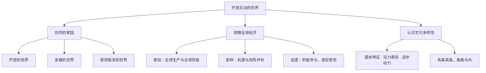

# 开放互动的世界

## 一、本知识点定位

统编版道德与法治九年级下册 **第一单元 我们共同的世界 第一课 同住地球村 第一框**。本框是九下开篇，从"共同的家园""放眼全球经济""认识文化多样性"三个层面描绘开放互动的当今世界，为下一框 [[复杂多变的关系]] 分析国际格局作铺垫。

## 二、核心观点梳理

### 1. 共同的家园（是什么）

- 当今世界是一个**开放的世界**：各国相互开放的程度不断加深，人们打破了地域界限。
- 当今世界是一个**发展的世界**：各国经济不断发展，全球经济格局深刻变化。
- 当今世界是一个**紧密联系的世界**：交通、通信技术使"地球村"形成，各国相互依赖程度加深。

### 2. 放眼全球经济（为什么会全球化及其影响）

- **经济全球化的主要表现**：商品生产在全球范围内完成；商品贸易在全球范围内进行。
- **积极影响**：为经济发展提供了新的机会，促进资金、技术、劳动力等生产要素在全球流动。
- **风险与挑战**：使风险与危机跨国界传递，一个国家的经济波动可能殃及他国。
- **正确态度**：不做被动的旁观者，而做积极的参与者；保持忧患意识，居安思危。

### 3. 认识文化多样性（怎么对待）

- 文化多样性是**人类社会的基本特征**，是**世界文化充满活力的表现**，也是**人类文明进步的重要动力**。
- 正确态度：**各美其美，美人之美，美美与共，天下大同**；在平等的基础上开展文化交流，既尊重差异、理解个性，又相互借鉴、共同发展。

## 三、知识结构图

## 四、关键金句与背记要点

1. 经济全球化的主要表现：**商品生产在全球范围内完成，商品贸易在全球范围内进行**。
2. 文化多样性是人类社会的基本特征，是人类文明进步的重要动力。
3. 面对经济全球化，要做**积极的参与者**，不做被动的旁观者。
4. 对待文化差异：平等交流、互相借鉴、求同存异。

## 五、易混易错辨析

- ❌"经济全球化只有好处" → ✅ 全球化是把双刃剑，机遇与挑战并存。
- ❌"文化多样性会阻碍文明发展" → ✅ 文化多样性是人类文明进步的重要动力。
- ❌"对待外来文化要全盘吸收或一概排斥" → ✅ 应平等交流、互相借鉴，取其精华。

## 六、时政链接

进博会、服贸会持续扩大开放"朋友圈"；"欢乐春节"等活动推动中外文化交流互鉴——可用于说明世界的开放互动与文化多样性。

## 七、自测题

1. 经济全球化的主要表现是什么？（全球生产、全球贸易）
2. 为什么要尊重文化多样性？（基本特征、活力表现、进步动力）
3. 面对经济全球化的风险，我们应持什么态度？（积极参与，居安思危）

## 八、相关知识点

- 下一框：[[复杂多变的关系]]，进一步分析国际格局与国家关系。
- 同单元：[[推动和平与发展]]、[[谋求互利共赢]]。
- 关联九上：[[共圆中国梦]]，开放的世界是中国梦实现的外部环境。
