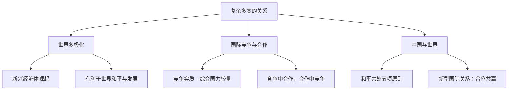

# 复杂多变的关系

## 一、本知识点定位

统编版道德与法治九年级下册 **第一单元 我们共同的世界 第一课 同住地球村 第二框**。承接 [[开放互动的世界]]，本框从世界多极化、国际竞争与合作、中国与世界的关系三个角度，分析当今复杂多变的国际关系。

## 二、核心观点梳理

### 1. 世界格局多极化（是什么）

- 冷战结束后，**世界多极化趋势**日益明显，国际社会力量对比正发生深刻变化。
- 一些发展中国家和新兴经济体快速发展，成为影响世界格局的重要力量。
- 世界多极化有利于国际关系民主化，有利于世界的和平与发展。

### 2. 国际竞争与合作（为什么复杂）

- 当今国际竞争的实质是**以经济和科技实力为基础的综合国力的较量**。
- 国家之间既有竞争，也有合作；竞争与合作并不是绝对对立的。
- 各国应在竞争中合作、在合作中竞争，通过协商对话化解矛盾与冲突。

### 3. 中国与世界（怎么相处）

- 中国与世界各国的联系日益紧密，中国的发展离不开世界，世界的繁荣也需要中国。
- 中国坚持**和平共处五项原则**，反对霸权主义和强权政治，推动建设相互尊重、公平正义、合作共赢的新型国际关系。

## 三、知识结构图

## 四、关键金句与背记要点

1. 国际竞争的实质：**以经济和科技实力为基础的综合国力的较量**。
2. 世界多极化趋势日益明显，新兴经济体成为影响世界格局的重要力量。
3. 中国推动建设**相互尊重、公平正义、合作共赢**的新型国际关系。
4. 国家之间应通过协商对话解决分歧，反对霸权主义和强权政治。

## 五、易混易错辨析

- ❌"国际竞争的实质是军事实力较量" → ✅ 是以经济和科技实力为基础的综合国力较量。
- ❌"国家之间只有竞争没有合作" → ✅ 竞争与合作并存，应在竞争中合作。
- ❌"世界已经形成多极格局" → ✅ 多极化是趋势，格局仍在演变之中。

## 六、时政链接

金砖国家合作机制扩员、上海合作组织发展壮大——体现新兴经济体力量上升与世界多极化趋势。

## 七、自测题

1. 当今国际竞争的实质是什么？（以经济和科技实力为基础的综合国力较量）
2. 世界多极化有什么意义？（有利于国际关系民主化，有利于和平与发展）
3. 中国主张建设怎样的新型国际关系？（相互尊重、公平正义、合作共赢）

## 八、相关知识点

- 上一框：[[开放互动的世界]]，认识开放世界是理解国际关系的前提。
- 下一课：[[推动和平与发展]]、[[谋求互利共赢]]。
- 后续呼应：[[中国担当]]，中国在复杂国际关系中的责任与作为。
