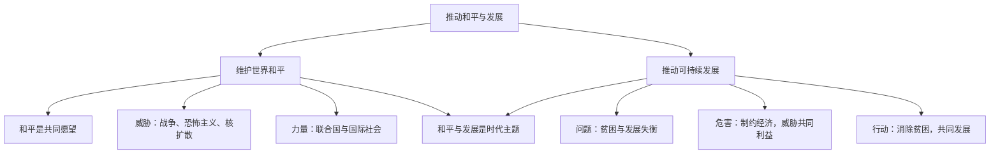

# 推动和平与发展

## 一、本知识点定位

统编版道德与法治九年级下册 **第一单元 我们共同的世界 第二课 构建人类命运共同体 第一框**。承接第一课对世界的整体认识，本框聚焦"和平与发展"这一**时代主题**，与下一框 [[谋求互利共赢]] 共同回答"如何构建人类命运共同体"。

## 二、核心观点梳理

### 1. 维护世界和平（是什么、为什么、怎么做）

- **和平是世界人民的共同愿望**。二战后，世界整体上维持和平态势，但战争的阴影从未远离。
- 威胁和平的因素：局部战争与冲突、恐怖主义、核扩散等。
- 维护和平的力量：联合国维和行动、国际社会的共同努力、爱好和平的人们的不懈追求。
- 中国主张：坚持走**和平发展道路**，通过和平方式解决国际争端。

### 2. 推动可持续发展（发展面临的问题）

- 发展是当今时代的主题之一，消除贫困是人类的共同愿望。
- 世界发展不平衡、不充分：**贫富分化**、南北发展差距依然巨大。
- 贫困及其衍生的饥饿、疾病、社会冲突等问题，制约着世界经济发展，威胁人类共同利益。
- 各国应共同担当，落实联合国**2030年可持续发展议程**，让发展成果惠及各国人民。

## 三、知识结构图

## 四、关键金句与背记要点

1. **和平与发展是当今时代的主题**。
2. 和平是世界人民的共同愿望，发展是各国面临的共同课题。
3. 消除贫困是当今世界面临的最大全球性挑战之一。
4. 中国始终是**世界和平的建设者、全球发展的贡献者、国际秩序的维护者**。

## 五、易混易错辨析

- ❌"当今世界已实现持久和平" → ✅ 世界整体和平，但局部冲突和不安定因素仍然存在。
- ❌"发展只是发展中国家自己的事" → ✅ 发展是全人类的共同课题，需要各国共同担当。
- ❌"和平与发展互不相关" → ✅ 和平是发展的前提，发展是和平的保障，二者相辅相成。

## 六、时政链接

中国持续参加联合国维和行动、提出全球发展倡议与全球安全倡议——体现中国推动世界和平与发展的努力。

## 七、自测题

1. 当今时代的主题是什么？（和平与发展）
2. 威胁世界和平的因素有哪些？（局部战争与冲突、恐怖主义、核扩散等）
3. 为什么要消除贫困？（贫困制约世界经济发展，威胁人类共同利益）

## 八、相关知识点

- 下一框：[[谋求互利共赢]]，从"共同体意识"角度深化本框主题。
- 上一课：[[开放互动的世界]]、[[复杂多变的关系]]。
- 后续呼应：[[中国担当]]，中国为世界和平与发展贡献力量。
