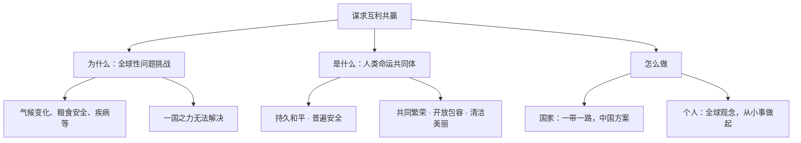

# 谋求互利共赢

## 一、本知识点定位

统编版道德与法治九年级下册 **第一单元 我们共同的世界 第二课 构建人类命运共同体 第二框**。承接 [[推动和平与发展]]，本框回答"面对全球性问题，人类应当怎么办"，核心是**构建人类命运共同体**理念，是中考高频考点。

## 二、核心观点梳理

### 1. 为什么要构建人类命运共同体

- 人类面临许多**全球性问题**：生态环境恶化、气候变化、粮食安全、能源资源短缺、网络安全、重大传染性疾病等。
- 这些问题的解决**依靠一国之力无法实现**，需要全世界人民同舟共济、携手合作。
- 各国相互联系、相互依存的程度空前加深，人类生活在同一个地球村，越来越成为你中有我、我中有你的命运共同体。

### 2. 人类命运共同体的内涵（是什么）

- 建设**持久和平、普遍安全、共同繁荣、开放包容、清洁美丽**的世界。
- 坚持对话协商、共建共享、合作共赢、交流互鉴、绿色低碳。

### 3. 怎么做（国家与个人层面）

- **国家层面**：中国积极推动构建人类命运共同体，共建"一带一路"，为全球治理贡献中国智慧和中国方案。
- **个人层面**：树立全球观念，关注世界发展；心系祖国又胸怀天下，从身边小事做起（如低碳生活）。

## 三、知识结构图

## 四、关键金句与背记要点

1. 构建人类命运共同体，建设**持久和平、普遍安全、共同繁荣、开放包容、清洁美丽**的世界（五个关键词必背）。
2. 采取共同行动、承担共同责任，成为国际社会的共识。
3. 面对全球性问题，任何国家都不能独善其身。
4. 青少年要树立**全球观念**，增强忧患意识与责任意识。

## 五、易混易错辨析

- ❌"全球性问题由大国解决即可" → ✅ 需要世界各国同舟共济、共同应对。
- ❌"构建人类命运共同体只是中国的事" → ✅ 是中国倡议、各国共同参与的全球方案。
- ❌"互利共赢就是平均分配利益" → ✅ 是在合作中兼顾各方利益、共同发展。

## 六、时政链接

中国推动《巴黎协定》落实、宣布"双碳"目标、共建"一带一路"高质量发展——均是构建人类命运共同体的生动实践。

## 七、自测题

1. 人类命运共同体理念要建设怎样的世界？（持久和平、普遍安全、共同繁荣、开放包容、清洁美丽）
2. 为什么要构建人类命运共同体？（全球性问题靠一国无法解决，各国命运与共）
3. 青少年可以为构建人类命运共同体做什么？（树立全球观念，从身边小事做起）

## 八、相关知识点

- 上一框：[[推动和平与发展]]，和平与发展是构建命运共同体的基础。
- 下一单元：[[中国担当]]、[[与世界深度互动]]，看中国的具体行动。
- 关联九上：[[共圆中国梦]]，中国梦与世界梦相通。
