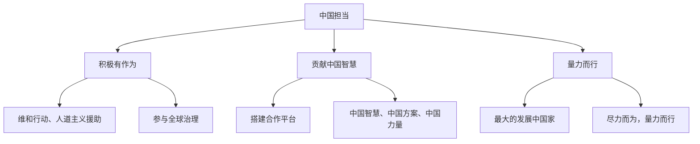

# 中国担当

## 一、本知识点定位

统编版道德与法治九年级下册 **第二单元 世界舞台上的中国 第三课 与世界紧相连 第一框**。第一单元讲"世界怎么样"，第二单元讲"中国怎么办"。本框展现中国在国际社会中的**责任与担当**，与下一框 [[与世界深度互动]] 共同构成第三课。

## 二、核心观点梳理

### 1. 积极有作为（中国担当的表现）

- 中国是一个**和平、合作、负责任**的大国，在国际社会中发挥着日益重要的作用。
- 面对各种区域性和全球性问题，中国**积极参与全球治理**，主动承担国际责任。
- 具体表现：参与联合国维和行动、开展国际人道主义援助、参与全球气候治理、推动世界经济增长等。

### 2. 贡献中国智慧（怎么担当）

- 中国把中国人民的利益同各国人民的共同利益结合起来，以**负责任的态度和行动**促进人类社会共同发展。
- 中国搭建多种合作平台（如"一带一路"国际合作高峰论坛、进博会），为世界提供公共产品。
- 中国在应对全球性挑战中贡献**中国智慧、中国方案、中国力量**。

### 3. 量力而行（担当的原则）

- 中国是世界上最大的发展中国家，承担国际责任要**尽力而为、量力而行**。
- 既不逃避责任，也不超出自身能力盲目承诺；集中力量办好自己的事，就是对世界的重大贡献。

## 三、知识结构图

## 四、关键金句与背记要点

1. 中国是一个**和平、合作、负责任**的大国。
2. 中国在应对全球性挑战中贡献**中国智慧、中国方案、中国力量**。
3. 承担国际责任要**尽力而为、量力而行**。
4. 办好自己的事，是中国对世界的重大贡献。

## 五、易混易错辨析

- ❌"中国应承担一切国际责任" → ✅ 中国是发展中国家，承担责任要量力而行。
- ❌"参与全球治理就是干涉别国内政" → ✅ 中国坚持不干涉内政原则，通过合作共赢参与治理。
- ❌"中国担当只体现在经济领域" → ✅ 涵盖和平安全、发展援助、生态环保等多个领域。

## 六、时政链接

中国海军亚丁湾护航、向发展中国家提供疫苗援助、推动全球发展倡议落地——均可作为"中国担当"的典型例证。

## 七、自测题

1. 中国是一个怎样的大国？（和平、合作、负责任）
2. 中国担当的表现有哪些？（参与维和、人道主义援助、全球治理等）
3. 中国承担国际责任的原则是什么？（尽力而为、量力而行）

## 八、相关知识点

- 下一框：[[与世界深度互动]]，中国与世界的双向影响。
- 上一单元：[[谋求互利共赢]]，中国担当是构建人类命运共同体的践行。
- 关联九上：[[共圆中国梦]]，大国担当彰显民族复兴的世界意义。
