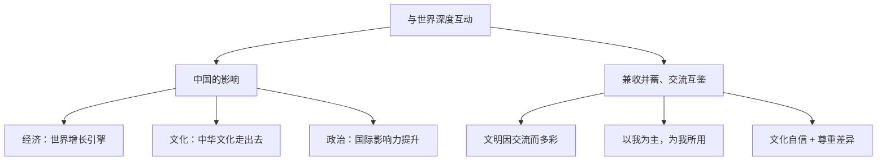

# 与世界深度互动

## 一、本知识点定位

统编版道德与法治九年级下册 **第二单元 世界舞台上的中国 第三课 与世界紧相连 第二框**。承接 [[中国担当]]，本框从"中国的影响"和"兼收并蓄、交流互鉴"两个方面，说明中国与世界的**双向深度互动**。

## 二、核心观点梳理

### 1. 中国的影响（中国给世界带来什么）

- **经济影响**：中国是世界经济增长的重要引擎，为世界各国提供了广阔市场和发展机遇。
- **文化影响**：中华文化走向世界（汉语热、中医药、春节文化等），为世界文明增添色彩。
- **政治影响**：中国的国际地位和国际影响力显著提升，在国际事务中发挥着越来越重要的作用。

### 2. 兼收并蓄、交流互鉴（世界给中国带来什么，中国怎么做）

- 文明因交流而多彩，文明因互鉴而丰富。
- 中国注重从不同文明中**汲取营养、寻求智慧**，丰富和发展中华文化。
- 对待外来文化的正确态度：以**开放包容**的心态，坚持**以我为主、为我所用**，取长补短、择善而从。
- 在交流互鉴中，既要认同本民族文化、增强文化自信，又要尊重其他文化。

## 三、知识结构图

## 四、关键金句与背记要点

1. 中国既通过自身发展积极影响世界，又主动学习借鉴人类文明的一切优秀成果。
2. **文明因交流而多彩，文明因互鉴而丰富**。
3. 对待外来文化：**兼收并蓄、交流互鉴，以我为主、为我所用**。
4. 中华文化在与世界文化的交流互鉴中焕发新的生机与活力。

## 五、易混易错辨析

- ❌"学习外来文化会削弱文化自信" → ✅ 交流互鉴中坚持以我为主，反而能增强文化生命力。
- ❌"中华文化走向世界就是文化输出、文化扩张" → ✅ 是平等交流互鉴，不是强加于人。
- ❌"中国影响世界只靠经济" → ✅ 经济、文化、政治等多方面共同发挥影响。

## 六、时政链接

海外中国文化中心与孔子学院促进汉语传播；《黑神话：悟空》等文化产品出海——体现中华文化的国际影响与文明交流互鉴。

## 七、自测题

1. 中国对世界的影响体现在哪些方面？（经济、文化、政治等）
2. 我们应以什么态度对待人类文明的优秀成果？（兼收并蓄、以我为主、为我所用）
3. 为什么说文明因交流而多彩？（交流互鉴丰富各国文化，推动文明进步）

## 八、相关知识点

- 上一框：[[中国担当]]，担当与互动是中国联系世界的两个侧面。
- 下一课：[[中国的机遇与挑战]]、[[携手促发展]]。
- 关联第一单元：[[开放互动的世界]]，文化多样性是交流互鉴的前提。
