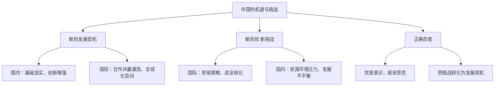

# 中国的机遇与挑战

## 一、本知识点定位

统编版道德与法治九年级下册 **第二单元 世界舞台上的中国 第四课 与世界共发展 第一框**。本框客观分析中国发展面临的**机遇与挑战**，为下一框 [[携手促发展]] 提出应对之策作铺垫，是辨析题、材料分析题的常考点。

## 二、核心观点梳理

### 1. 新的发展契机（机遇有哪些）

- 当前，中国的发展仍处于**重要战略机遇期**。
- **国内机遇**：改革开放奠定的坚实基础；经济结构优化升级；科技创新能力增强；劳动者素质提高。
- **国际机遇**：和平、发展、合作、共赢的时代潮流；世界多极化、经济全球化为中国发展提供广阔空间；国际影响力不断提升带来更多合作伙伴。

### 2. 新风险 新挑战（挑战有哪些）

- **国际挑战**：受国际局势影响，地区冲突、贸易摩擦、逆全球化思潮等增加外部不确定性；一些国家对中国的发展存在误解和防范。
- **国内挑战**：经济发展进入新常态，面临人口、资源、环境等方面的压力；区域发展不平衡、城乡差距、社会民生领域仍有短板。

### 3. 正确态度（怎么看待）

- 机遇与挑战并存，机遇前所未有，挑战也前所未有。
- 要以**居安思危的忧患意识**和**改革创新的实际行动**，把握机遇、迎接挑战，将挑战转化为发展的动力和契机。

## 三、知识结构图

## 四、关键金句与背记要点

1. 中国的发展仍处于**重要战略机遇期**。
2. 机遇与挑战并存，困难与希望同在。
3. 面对挑战要有**忧患意识**，也要有**战略定力**和必胜信心。
4. 抓住机遇、勇敢面对挑战，才能赢得发展的主动权。

## 五、易混易错辨析

- ❌"中国的发展一帆风顺，没有风险" → ✅ 机遇与挑战并存，须居安思危。
- ❌"挑战只来自外部" → ✅ 既有外部环境的挑战，也有国内发展的压力。
- ❌"面对挑战只能被动应对" → ✅ 可以主动作为，把挑战转化为发展契机。

## 六、时政链接

面对个别国家的科技封锁，中国加快高水平科技自立自强（如国产大飞机C919、芯片攻关）——体现变压力为动力、化挑战为机遇。

## 七、自测题

1. 中国发展面临哪些机遇？（国内基础与创新能力、国际合作空间等）
2. 中国发展面临哪些挑战？（贸易摩擦、资源环境压力、发展不平衡等）
3. 如何正确看待机遇与挑战？（并存关系，居安思危，化挑战为契机）

## 八、相关知识点

- 下一框：[[携手促发展]]，回答"面对机遇挑战怎么办"。
- 上一课：[[中国担当]]、[[与世界深度互动]]。
- 关联第一单元：[[复杂多变的关系]]，国际格局变化是机遇挑战的来源。
