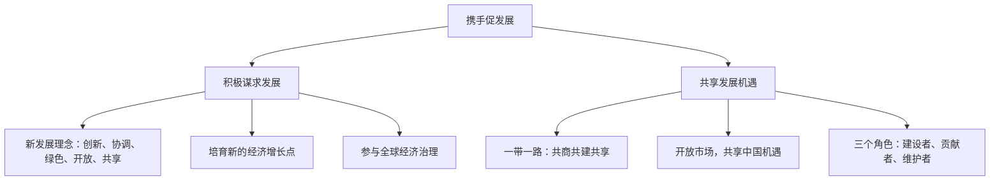

# 携手促发展

## 一、本知识点定位

统编版道德与法治九年级下册 **第二单元 世界舞台上的中国 第四课 与世界共发展 第二框**。承接 [[中国的机遇与挑战]]，本框从"积极谋求自身发展"和"携手共建美好世界"两方面，回答中国如何与世界共发展，是第二单元的收束。

## 二、核心观点梳理

### 1. 积极谋求发展（对内怎么做）

- 把提升发展质量放在首位：贯彻**新发展理念**（创新、协调、绿色、开放、共享），推动高质量发展。
- 积极寻求新的**经济增长点**：发展高技术产业、战略性新兴产业，培育新动能。
- 以更加开放的姿态参与全球经济治理，推动经济全球化朝着更加**开放、包容、普惠、平衡、共赢**的方向发展。

### 2. 共享发展机遇（对外怎么做）

- 中国的发展不仅造福中国人民，也为世界各国提供发展机遇。
- 共建**"一带一路"**：坚持共商共建共享原则，促进沿线国家和地区的共同发展。
- 中国致力于成为世界和平的建设者、全球发展的贡献者、国际秩序的维护者。
- 通过进博会等平台向世界开放市场，让各国搭乘中国发展的"快车""便车"。

## 三、知识结构图

## 四、关键金句与背记要点

1. 新发展理念：**创新、协调、绿色、开放、共享**（五个词必背）。
2. "一带一路"建设坚持**共商共建共享**原则。
3. 中国是世界和平的**建设者**、全球发展的**贡献者**、国际秩序的**维护者**。
4. 中国的发展离不开世界，世界的繁荣也需要中国。

## 五、易混易错辨析

- ❌"谋求自身发展就要关起门来搞建设" → ✅ 要坚持对外开放，在开放中谋发展。
- ❌"'一带一路'只让中国受益" → ✅ 坚持共商共建共享，实现互利共赢。
- ❌"共享机遇就是无偿援助他国" → ✅ 是合作共赢、共同发展，不是单向输出。

## 六、时政链接

中欧班列开行数量持续增长、"一带一路"标志性工程雅万高铁通车——体现中国与共建国家携手发展、互利共赢。

## 七、自测题

1. 新发展理念的内容是什么？（创新、协调、绿色、开放、共享）
2. "一带一路"建设坚持什么原则？（共商共建共享）
3. 中国如何与世界携手促发展？（谋求自身高质量发展＋与各国共享发展机遇）

## 八、相关知识点

- 上一框：[[中国的机遇与挑战]]，本框是其"怎么办"的回答。
- 同单元：[[中国担当]]、[[与世界深度互动]]。
- 下一单元：[[走向世界大舞台]]，从国家担当转向少年担当。
