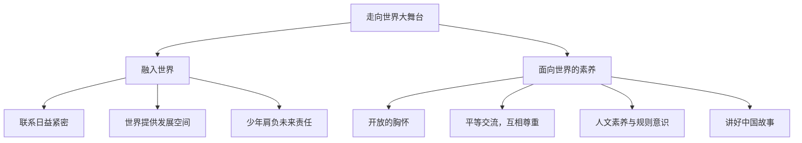

# 走向世界大舞台

## 一、本知识点定位

统编版道德与法治九年级下册 **第三单元 走向未来的少年 第五课 少年的担当 第一框**。前两个单元讲世界与中国，第三单元回归"少年自身"。本框引导青少年认识自己与世界的联系，与下一框 [[少年当自强]] 共同回答"少年如何担当"。

## 二、核心观点梳理

### 1. 融入世界（为什么少年与世界相关）

- 随着全球化的深入，我们同世界的联系日益紧密：出国研学、国际赛事、网络交流等让青少年有更多机会走向世界。
- 世界为我们提供了广阔的发展空间和展示自我的舞台；我们也在与世界的互动中丰富知识、开阔眼界、增长才干。
- 青少年是**国家和民族的未来**，也是世界的未来，肩负着推动人类共同发展的责任。

### 2. 面向世界的素养（怎么做）

- **开放的胸怀**：尊重差异，平等相待，以开放的心态与不同文化背景的人交往。
- **平等交流、互相尊重**：既不妄自尊大，也不妄自菲薄；讲好中国故事，展示中国形象。
- **提升人文素养**：学习多元文化知识，掌握与人交往的礼仪与艺术。
- **增强规则意识**：了解并遵守国际规则，做有教养、负责任的世界公民。

## 三、知识结构图

## 四、关键金句与背记要点

1. 青少年要以**开放的心态**融入世界，在与世界互动中成长。
2. 与不同文化交往时：**不妄自尊大，也不妄自菲薄**。
3. 用世界的眼光看待问题，用自己的行动**讲好中国故事**。
4. 走向世界，既要有本领，也要有素养与担当。

## 五、易混易错辨析

- ❌"走向世界就是崇拜外国文化" → ✅ 是平等交流互鉴，坚守中华文化立场。
- ❌"融入世界是长大以后的事" → ✅ 青少年现在就可以通过学习、交流参与其中。
- ❌"讲好中国故事只是国家宣传部门的事" → ✅ 每个青少年都是中国形象的名片。

## 六、时政链接

中学生参加国际中学生科学奥林匹克竞赛、担任国际体育赛事志愿者——展现中国少年走向世界舞台的风采。

## 七、自测题

1. 为什么说青少年与世界的联系日益紧密？（全球化深入，交流机会增多）
2. 走向世界需要具备哪些素养？（开放胸怀、平等交流、人文素养、规则意识）
3. 如何在对外交往中展示中国形象？（讲好中国故事，不卑不亢，以行动作名片）

## 八、相关知识点

- 下一框：[[少年当自强]]，担当需要以自强为底气。
- 上一单元：[[与世界深度互动]]，国家层面的互动为少年提供舞台。
- 关联九上：[[促进民族团结]]，家国情怀是走向世界的根基。
