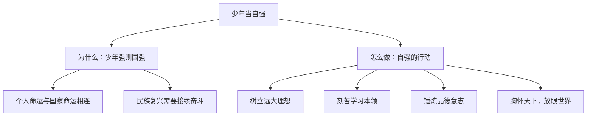

# 少年当自强

## 一、本知识点定位

统编版道德与法治九年级下册 **第三单元 走向未来的少年 第五课 少年的担当 第二框**。承接 [[走向世界大舞台]]，本框回答"少年如何担当起时代与国家赋予的使命"，核心词是**自强**与**担当**。

## 二、核心观点梳理

### 1. 少年与国家（为什么要自强）

- **少年强则国强**。青少年的品格、素养和能力，关系着国家和民族的未来。
- 青少年的命运始终同国家和民族的命运紧密相连；实现中华民族伟大复兴的中国梦，需要一代代青少年接续奋斗。
- 当今世界竞争激烈，只有自强不息，才能担负起历史重任。

### 2. 担当的行动（怎么做）

- **树立远大理想**：把个人理想融入国家和民族的事业之中，立志报效祖国。
- **刻苦学习本领**：珍惜受教育机会，掌握科学文化知识，提高创新能力。
- **锤炼品德意志**：培养责任意识、艰苦奋斗精神，在磨砺中成长。
- **心系世界发展**：胸怀天下，关注人类共同命运，做有全球视野的中国少年。

## 三、知识结构图

## 四、关键金句与背记要点

1. **少年强则国强**，青少年素养关系国家民族的未来。
2. 把**个人理想融入国家和民族的事业**之中。
3. 自强的关键：远大理想 + 过硬本领 + 优良品德。
4. 青少年既要心系祖国，又要放眼世界、面向未来。

## 五、易混易错辨析

- ❌"自强就是单打独斗、不需要合作" → ✅ 自强与团结合作并不矛盾，担当需要协作。
- ❌"报效祖国是成年后的事" → ✅ 当下努力学习、锤炼品格就是在为报国做准备。
- ❌"个人理想与国家发展无关" → ✅ 个人理想只有融入国家事业才更有价值。

## 六、时政链接

"清澈的爱，只为中国"——戍边战士陈祥榕的青春誓言；全国青少年科技创新大赛涌现的少年发明者——诠释新时代少年的自强与担当。

## 七、自测题

1. 为什么少年当自强？（少年强则国强，个人命运与国家命运相连）
2. 青少年怎样做到自强？（立理想、学本领、炼品德、怀天下）
3. 如何理解"把个人理想融入国家事业"？（在服务国家中实现人生价值）

## 八、相关知识点

- 上一框：[[走向世界大舞台]]，世界舞台是少年担当的空间。
- 下一课：[[学无止境]]、[[多彩的职业]]，学习与职业是担当的具体路径。
- 关联九上：[[共圆中国梦]]，少年自强是圆梦的力量源泉。
