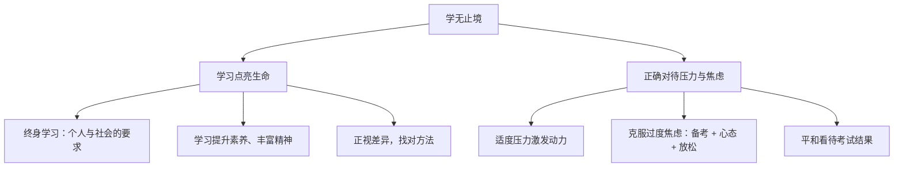

# 学无止境

## 一、本知识点定位

统编版道德与法治九年级下册 **第三单元 走向未来的少年 第六课 我的毕业季 第一框**。毕业在即，本框引导学生正确看待学习压力与考试焦虑，树立**终身学习**观念，与下一框 [[多彩的职业]] 共同帮助学生规划毕业后的道路。

## 二、核心观点梳理

### 1. 学习点亮生命（为什么要学习）

- 学习没有终点，我们要养成**终身学习**的习惯：现代社会知识更新加快，终身学习既是个人可持续发展的要求，也是社会发展的必然要求。
- 学习不仅是获取知识，更是提升素养、丰富精神世界、点亮生命的过程。
- 每个人的学习状况不同，要正视自身的学习压力和学习差异，找到适合自己的学习方法。

### 2. 正确对待学习压力与考试焦虑（怎么做）

- **学习压力**：适度的压力可以激发学习动力；压力过大则影响学习效率和身心健康。要学会正确对待，将压力转化为动力。
- **考试焦虑**：适度的焦虑是正常的；可通过**认真备考增强实力、调整心态、掌握放松技巧**等方式克服过度焦虑。
- 用平和的心态对待考试结果，正确看待成绩，不以一次考试论成败。

## 三、知识结构图

## 四、关键金句与背记要点

1. 学习没有终点，要养成**终身学习**的习惯。
2. 适度的学习压力可以**激发学习动力**，压力过大则有害。
3. 缓解考试焦虑三法：**增强实力、调整心态、放松训练**。
4. 一次考试不能定义人生，成长比分数更重要。

## 五、易混易错辨析

- ❌"毕业了就不用再学习" → ✅ 学习贯穿一生，终身学习是时代要求。
- ❌"学习压力都是坏事" → ✅ 适度压力有积极作用，关键在于调节。
- ❌"考试焦虑必须完全消除" → ✅ 适度焦虑正常且有益，需克服的是过度焦虑。

## 六、时政链接

国家推进学习型社会、学习型大国建设，发展社区教育与老年教育——终身学习已成为国家战略。

## 七、自测题

1. 为什么要终身学习？（知识更新加快，个人发展与社会发展的共同要求）
2. 如何正确对待学习压力？（正视压力，将适度压力转化为动力）
3. 怎样克服过度的考试焦虑？（认真备考、调整心态、掌握放松方法）

## 八、相关知识点

- 下一框：[[多彩的职业]]，学习为职业选择奠基。
- 上一课：[[少年当自强]]，刻苦学习是自强的重要内容。
- 后续：[[回望成长]]、[[走向未来]]，以学习姿态迎接人生新阶段。
