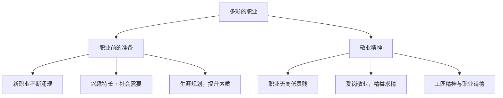

# 多彩的职业

## 一、本知识点定位

统编版道德与法治九年级下册 **第三单元 走向未来的少年 第六课 我的毕业季 第二框**。承接 [[学无止境]]，本框引导学生认识职业世界、做好**职业准备**、树立正确的职业观和敬业精神，帮助学生思考"毕业后走向哪里"。

## 二、核心观点梳理

### 1. 职业前的准备（怎么选择与准备）

- 社会发展催生了许多**新职业**（如数字经济、人工智能相关职业），职业选择日益多样。
- 职业选择要考虑：**个人兴趣、能力特长**与**国家和社会需要**相结合。
- 做好职业准备：了解职业信息，提升自身素质，进行合理的**生涯规划**；无论升学还是就业，都是人生的重要选择。

### 2. 敬业精神（怎么对待职业）

- 职业没有高低贵贱之分，每种正当职业都值得尊重。
- **爱岗敬业**是社会主义核心价值观在职业领域的要求：干一行、爱一行、钻一行。
- 敬业的表现：认真负责、精益求精、乐于奉献；**工匠精神**是敬业的生动体现。
- 履行职业中的**法定义务与约定义务**，诚实守信，遵守职业道德。

## 三、知识结构图

## 四、关键金句与背记要点

1. 职业选择要把**个人兴趣特长**与**国家和社会需要**结合起来。
2. **爱岗敬业**是社会主义核心价值观对职业活动的要求。
3. 敬业精神的核心：认真负责、精益求精、乐于奉献。
4. 每种正当职业都值得尊重，劳动不分贵贱。

## 五、易混易错辨析

- ❌"职业有高低贵贱之分" → ✅ 正当职业只有分工不同，没有贵贱之别。
- ❌"选职业只看收入高低" → ✅ 应综合考虑兴趣、能力与社会需要。
- ❌"敬业是就业以后才需要的" → ✅ 中学阶段认真做事就是敬业精神的培养。

## 六、时政链接

人力资源社会保障部发布"生成式人工智能系统应用员"等新职业；"大国工匠"年度人物事迹——体现职业世界的变化与工匠精神的时代价值。

## 七、自测题

1. 职业选择应考虑哪些因素？（个人兴趣、能力特长、国家和社会需要）
2. 什么是敬业精神？（认真负责、精益求精、乐于奉献的职业态度）
3. 为什么说职业没有高低贵贱之分？（每种正当职业都是社会需要，都值得尊重）

## 八、相关知识点

- 上一框：[[学无止境]]，终身学习是职业发展的支撑。
- 同单元：[[少年当自强]]，职业是报效祖国的舞台。
- 后续：[[走向未来]]，职业规划是走向未来的重要一步。
