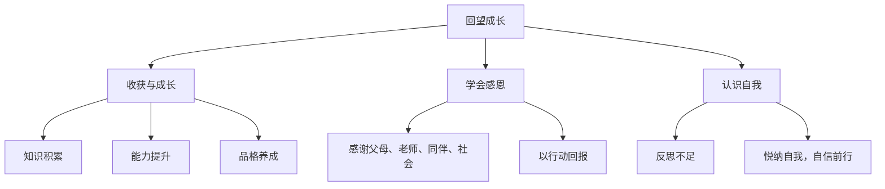

# 回望成长

## 一、本知识点定位

统编版道德与法治九年级下册 **第三单元 走向未来的少年 第七课 从这里出发 第一框**。第七课是初中道法课程的收官。本框引导学生**回顾三年成长历程**、学会感恩、认识自我，为下一框 [[走向未来]] 展望人生新阶段作准备。

## 二、核心观点梳理

### 1. 收获与成长（我们收获了什么）

- **知识的积累**：掌握了科学文化知识，学会了学习的方法。
- **能力的提升**：提高了交往合作、独立思考、解决问题的能力。
- **品格的养成**：形成了道德观念、法治意识、责任意识，价值观日渐成熟。
- 成长不仅体现在成绩上，更体现在**身心的成熟与精神的丰盈**上。

### 2. 学会感恩（该感谢谁）

- 成长离不开**父母的养育、老师的教诲、同伴的陪伴、社会的支持**。
- 感恩不能只停留在口头上，要用**实际行动**回报：孝敬父母、尊敬师长、关爱他人、服务社会。

### 3. 认识自我、悦纳自我（怎么看自己）

- 回望成长也要**反思不足**：正视自己的缺点与遗憾，把它们作为继续成长的起点。
- 学会**接纳自己、欣赏自己**，既不骄傲自满，也不妄自菲薄，带着自信走向未来。

## 三、知识结构图

## 四、关键金句与背记要点

1. 成长的收获：**知识、能力、品格**三个维度。
2. 感恩要落实在**行动**上，而非停留在口头。
3. 正视不足是继续成长的起点，**悦纳自我**是走向未来的底气。
4. 三年初中生活是人生宝贵的精神财富。

## 五、易混易错辨析

- ❌"成长就是成绩提高" → ✅ 成长是知识、能力、品格的全面发展。
- ❌"感恩就是说声谢谢" → ✅ 更要用实际行动回报关爱。
- ❌"反思不足就是否定自己" → ✅ 反思是为了更好地成长，应与悦纳自我相统一。

## 六、时政链接

各地中学开展"十四岁集体生日""毕业感恩课"等仪式教育——引导学生在回望中懂得感恩、坚定前行。

## 七、自测题

1. 初中三年我们在哪些方面获得成长？（知识、能力、品格）
2. 应该如何表达感恩？（孝敬父母、尊敬师长、关爱他人、服务社会等行动）
3. 如何正确认识自我？（正视不足，悦纳自我，自信前行）

## 八、相关知识点

- 下一框：[[走向未来]]，从回望走向展望。
- 上一课：[[学无止境]]、[[多彩的职业]]，毕业季的思考一脉相承。
- 关联：[[少年当自强]]，成长的收获是自强的资本。
