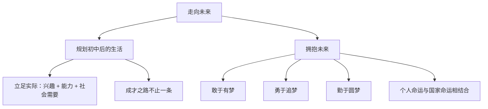

# 走向未来

## 一、本知识点定位

统编版道德与法治九年级下册 **第三单元 走向未来的少年 第七课 从这里出发 第二框**。这是初中道德与法治课程的**最后一框**，承接 [[回望成长]]，引导学生规划人生、拥抱未来，为整个初中学段画上句号。

## 二、核心观点梳理

### 1. 规划初中后的生活（怎么规划）

- 毕业意味着新的开始，站在人生的十字路口，要**认真规划、慎重选择**。
- 规划要立足实际：结合**自身兴趣、能力、家庭情况**与**社会需要**，选择适合自己的道路（升学、职业教育等）。
- 无论选择哪条路，都要脚踏实地、一步一个脚印地走下去；条条大路通罗马，成才的路不止一条。

### 2. 拥抱未来（以什么姿态出发）

- 未来充满**机遇与挑战**，要以积极的心态迎接不确定性。
- **敢于有梦**：树立理想，志存高远；**勇于追梦**：付诸行动，不懈奋斗；**勤于圆梦**：脚踏实地，久久为功。
- 把个人的前途命运与**国家、民族、人类的命运**结合起来，在奉献中书写人生华章。
- 从这里出发，带着初中三年的收获，自信地走向广阔的未来。

## 三、知识结构图

## 四、关键金句与背记要点

1. 人生规划要把**自身实际**与**社会需要**结合起来。
2. **敢于有梦、勇于追梦、勤于圆梦**（三个"梦"必背）。
3. 成才的道路不止一条，适合自己的就是最好的。
4. 把个人梦想融入中国梦，在奉献中实现人生价值。

## 五、易混易错辨析

- ❌"只有升入重点高中才算成功" → ✅ 成才路径多样，职业教育同样大有可为。
- ❌"规划定了就不能改变" → ✅ 规划应根据实际情况动态调整。
- ❌"追梦只靠美好愿望" → ✅ 梦想需要脚踏实地的奋斗来实现。

## 六、时政链接

国家大力发展现代职业教育，"技能成才、技能报国"成为青年新选择；新时代青年在乡村振兴、科技创新一线建功立业——印证成才之路的多样与广阔。

## 七、自测题

1. 如何规划初中毕业后的生活？（立足自身实际，结合社会需要，慎重选择）
2. 以怎样的姿态拥抱未来？（敢于有梦、勇于追梦、勤于圆梦）
3. 个人前途与国家命运是什么关系？（紧密相连，个人梦融入中国梦）

## 八、相关知识点

- 上一框：[[回望成长]]，回望是为了更好地出发。
- 同单元：[[少年当自强]]、[[走向世界大舞台]]，未来属于自强的少年。
- 关联九上：[[共圆中国梦]]，个人未来与民族复兴同频共振。
